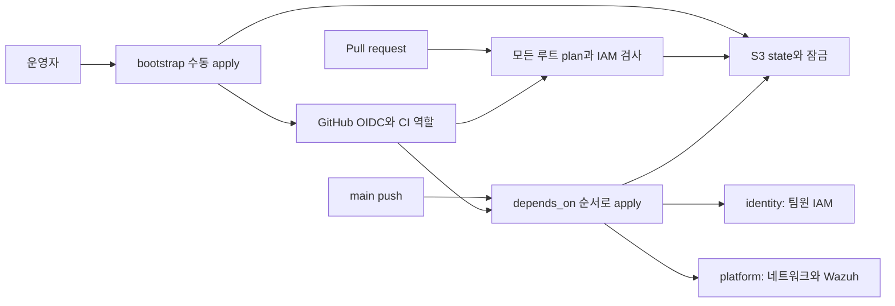
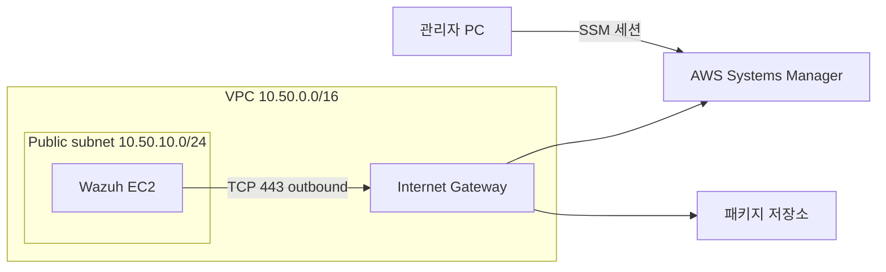
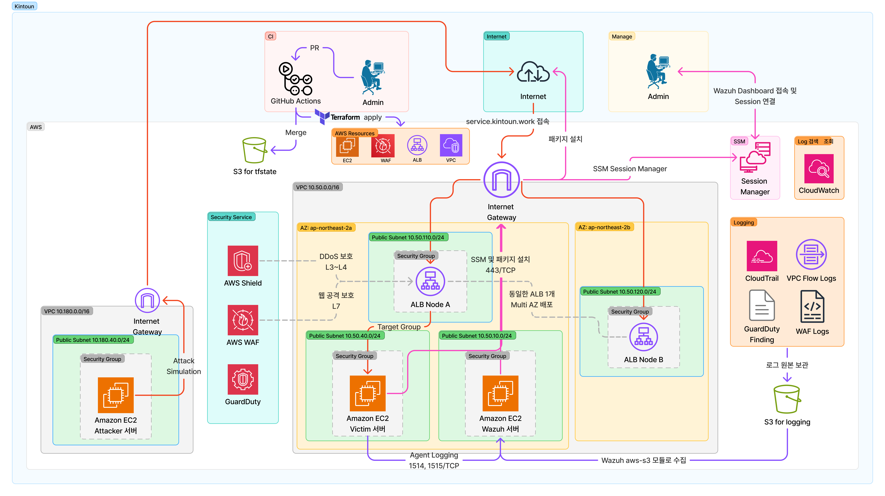

# 아키텍처

기본 리전은 서울(`ap-northeast-2`)이다. Terraform state는 암호화와 버전 관리를
사용하는 S3 버킷에 저장하며 루트별 `.tflock` 객체로 잠근다.

## 관리 경로

| 루트 | 관리 대상 | State key | 적용 주체 |
| --- | --- | --- | --- |
| `bootstrap` | state 버킷, OIDC, CI 역할과 보호 정책 | `bootstrap/terraform.tfstate` | 운영자 |
| `identity` | 사용자, 관리 그룹, 소속, 셀프 서비스·MFA 정책 | `identity/terraform.tfstate` | CI |
| `platform` | 네트워크, Wazuh EC2, SSM·로그인 정책 | `platform/terraform.tfstate` | CI |

현재 매니페스트에서 `identity`와 `platform`의 `depends_on`은 모두 비어 있어
같은 wave에서 병렬 적용된다. 두 루트가 참조하는 기존 팀 그룹은 AWS에 준비되어
있어야 한다. 앞으로 한 루트가 다른 루트에서 만드는 자원을 사용한다면 출력과
`terraform_remote_state`, 매니페스트 의존성을 함께 추가한다.

## Wazuh 통신 경로

서버에 연결된 `wazuh_sg`는 inbound 규칙이 없고 outbound TCP 443만 허용한다.
대시보드 접속은 SSM으로 로컬 포트 56789를 인스턴스의 443 포트에 연결한다.
퍼블릭 서브넷의 자동 공인 IP 할당은 꺼져 있지만 Wazuh EC2는 최초 생성 때
명시적으로 공인 IP를 요청한다. NAT Gateway나 VPC endpoint는 현재 코드에 없다.

별도의 `wazuh_sg_agent`는 생성 및 출력만 한다. 현재 Wazuh EC2에 연결되어 있지 않고
ingress/egress 규칙도 없다. 후속 agent 연동에서는 보안 그룹 연결과 통신 규칙을 함께 설계해야 한다.

## 권한과 데이터 경계

- CI는 장기 AWS 키 대신 OIDC로 임시 세션을 받는다. apply 역할은 `main`의 subject만 허용한다.
- CI 역할, 인프라 역할과 팀원 사용자에는 각 모듈의 `permissions_boundary_arn`을 적용한다.
- state와 잠금의 권한을 분리한다. state 객체 삭제는 명시적으로 거부하고 `.tflock` 삭제는 허용한다.
- apply 역할은 CI 역할·OIDC 공급자·state 접근 정책·지정된 경계 정책을 수정할 수 없다.
- Wazuh 루트 EBS는 암호화되며 EC2 종료 후에도 보존된다. 교체된 서버에 자동 재연결되지는 않는다.

운영 절차는 [State와 장애 대응](runbooks/terraform.md)과
[Wazuh 접속 및 복구](runbooks/wazuh.md)에 있다.

## 전체 설계 참고

기존 전체 설계도에는 victim·attacker, ALB·WAF, 로깅 등 후속 구성도 포함되어 있다.
현재 Terraform 구현 범위는 위 모듈 표와 [프로젝트 개요](index.md#구현-범위)를 기준으로 확인한다.

