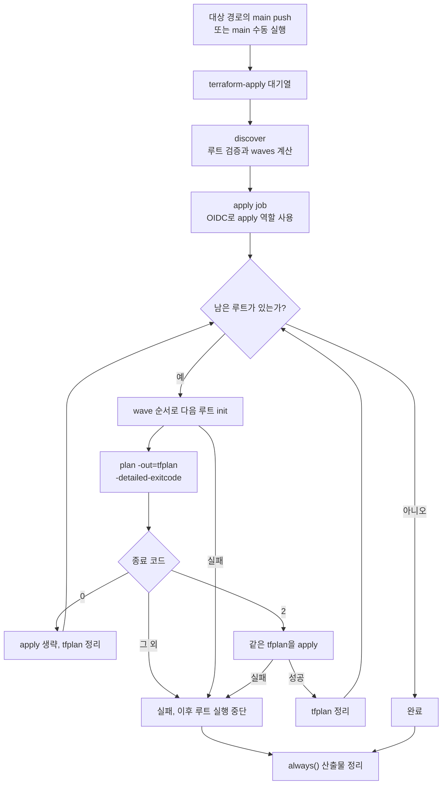

# Main apply

실행 정의는 [terraform-apply.yml](https://github.com/kintoun-secops/kintoun-infra/blob/main/.github/workflows/terraform-apply.yml)에 있다.
PR의 plan 파일을 재사용하지 않고 main 코드로 새 plan을 만든 뒤 같은 러너에서 적용한다.
현재 main 워크플로는 `_tf-root.yml`의 apply 모드를 호출하지 않는다.

## 실행 흐름

`discover`가 실패하면 apply job을 실행하지 않는다. 취소된 실행도 마지막 정리 스텝의 대상이다.

## 적용과 재실행

`terraform-apply.yml`은 main push와 수동 실행을 지원한다.
`tf-roots.js`가 `depends_on` 그래프의 깊이를 계산하고, apply job이 결과 배열을 반복하며
모든 wave를 순서대로 실행한다. 같은 wave의 루트는 한 job 안에서 차례로 적용한다.

각 루트는 같은 러너에서 `plan -detailed-exitcode -out=tfplan`을 실행한다.

| 종료 코드 | 처리 |
| --- | --- |
| `0` | 변경 없음, apply 생략 |
| `2` | 생성한 `tfplan`을 apply |
| 그 외 | 실패 |

워크플로의 `queue: max`가 최대 100개 실행을 대기시킨다. 한 실행 안에서는 루트별
plan과 apply가 연속으로 실행된다. 대기열은 대기 시작 시각의 FIFO이며 커밋 순서를
보장하지는 않는다([GitHub concurrency 안내](https://docs.github.com/en/actions/how-tos/write-workflows/choose-when-workflows-run/control-workflow-concurrency)).
문서처럼 `paths-ignore`에 해당하는 파일만 머지하면 자동 apply는 실행하지 않는다.
그 외 파일이 함께 바뀌거나 수동 실행하면 모든 루트를 다시 plan하므로
기존 인프라 드리프트가 있다면 apply 대상에 포함될 수 있다.
어느 루트에서든 init, plan 또는 apply가 실패하면 뒤의 루트와 wave는 실행하지 않는다.
plan 파일은 실패나 취소 시에도 정리한다.

수동 재실행은 Actions → terraform apply → Run workflow에서 **main**을 선택한다.
apply 역할의 OIDC trust가 main subject만 허용한다.

wave 계산과 새 루트 등록은 [저장소 구조](../structure.md#apply-순서-계산)를 참고한다.
PR에서는 [apply 순서 코멘트](plan.md#apply-순서-코멘트)로 의존성 변경을 확인한다.
