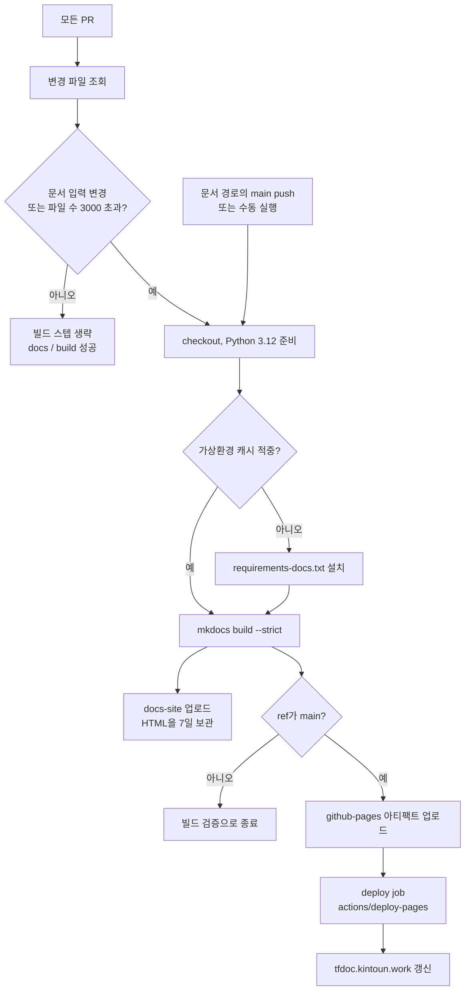

# 문서 CI와 Pages

실행 정의는 [docs.yml](https://github.com/kintoun-secops/kintoun-infra/blob/main/.github/workflows/docs.yml)에 있다.
작성 규칙과 로컬 명령은 [문서 작성과 미리 보기](../documentation.md)를 참고한다.

## 빌드 흐름

변경 파일 조회가 실패하면 job도 실패한다. 이름이 바뀐 파일은 이전 경로도 변경 파일로 본다.
push 경로 필터와 PR 감지 패턴은 함께 관리한다.
PR은 빌드 검증까지만 하고 사이트 배포는 main에서만 일어난다.

## GitHub Actions CI

`.github/workflows/docs.yml`은 모든 PR, 문서 관련 경로가 바뀐 main push, 수동 실행에서 동작한다.

1. 첫 스텝이 PR의 변경 파일을 조회해 `docs/`, Markdown 파일, `mkdocs.yml`,
   `requirements-docs.txt`, 워크플로 자신 가운데 하나라도 바뀌었는지 확인한다.
   해당 없는 PR은 이후 스텝을 모두 건너뛴다. push와 수동 실행은 항상 빌드한다.
2. Python 3.12를 준비하고 러너 OS, Python 패치 버전, `requirements-docs.txt` 해시를
   키로 가상환경을 캐시한다. 캐시가 있으면 의존성 설치를 건너뛴다.
3. `.venv/bin/python -m mkdocs build --strict`로 문서와 내부 링크를 검증한다.
4. `site/`만 `docs-site` 아티팩트로 7일 보관한다.
5. `github.ref`가 `refs/heads/main`이면 `actions/upload-pages-artifact`로 `site/`를
   한 번 더 올리고, build 성공에 이어 `deploy` job이 `actions/deploy-pages`로 배포한다.
   PR의 ref는 `refs/pull/<번호>/merge`이므로 이 조건에서 걸러진다.

PR 트리거에 경로 필터를 두지 않는 이유는 필수 검사 때문이다. 필터로 실행 자체가
건너뛰어진 워크플로는 검사 상태를 보고하지 않아 머지를 영원히 막는다. 반면 `if`로
건너뛴 스텝은 성공으로 보고되므로 문서와 무관한 PR도 몇 초 만에 통과한다.
main push는 필수 검사가 아니므로 트리거의 `paths` 목록으로 거른다. 이 목록과
감지 스텝의 목록은 항상 함께 고친다.

build job의 권한은 `contents: read`와 변경 파일 조회용 `pull-requests: read`다.
배포 생성용 `pages: write`와 아티팩트 출처 검증용 `id-token: write`는 deploy job에만 준다.
AWS 자격증명은 필요하지 않다.
액션은 SHA로 고정하고 Dependabot이 액션과 pip 의존성을 매주 확인한다.
필수 검사로 사용할 이름은 **`docs / build`**다.

Actions → docs → 실행 결과 → Artifacts에서 `docs-site`를 받아 압축을 풀고
해당 디렉터리에서 `python -m http.server 8000`을 실행하면 빌드 결과를 볼 수 있다.
문서와 무관한 push는 빌드하지 않으므로 아티팩트는 마지막 문서 변경 실행에서 받는다.
Material의 Mermaid 렌더러는 외부 CDN을 사용하므로 다이어그램 표시는 인터넷 연결이 필요하다.

## 의존성 상태 점검

의존성 상태 감시는 Dependabot에 맡긴다. pip 설정은 이름에 `requirements`가
들어간 `.txt`를 수집하므로 `requirements-docs.txt`가 감시 대상이고, 새 버전이
나오면 minor·patch는 하나의 PR로 묶이며 major는 개별 PR로 온다.
알려진 취약점 알림은 저장소 Settings에서 Dependency graph와 Dependabot alerts를
켜서 받는다. 이 알림은 requirements에 적힌 직접 의존성이 대상이며 전이 의존성은
검사하지 않는다.

## MkDocs 2.0 대응

mkdocs는 1.6.1, mkdocs-material은 9.7.7로 고정하며 2026-09-07 확인 기준
두 버전 모두 최신 정식 릴리스다. MkDocs 2.0은 프리릴리스 상태이며 플러그인
시스템 제거, 테마 재작성, TOML 설정 전환으로 Material 테마와 호환되지 않고,
mkdocs-material이 `mkdocs<2`를 선언해 설치 자체가 차단된다.

2.x 정식 릴리스가 나오면 Dependabot이 major 개별 PR을 올린다.
그 PR은 병합하지 않는다 — 의존성 충돌로 CI 빌드도 실패한다.
이 신호로 충분하므로 Material이 빌드마다 출력하는 2.0 경고 배너는
CI에서 `NO_MKDOCS_2_WARNING=1`로 끈다.
1.x는 더 이상 릴리스가 없으므로, 그 시점에 Material 팀의 1.x 호환 후속 도구인
[Zensical](https://zensical.org/)의 안정화 여부를 평가해 이행을 결정한다.

## Pages 배포

저장소가 public이므로 GitHub Free 조직에서도 Pages를 사용할 수 있다.
Settings → Pages의 Source는 GitHub Actions이고 사용자 지정 도메인은 `tfdoc.kintoun.work`다.
도메인은 Pages 설정에 저장되므로 빌드 결과에 `CNAME` 파일을 넣지 않는다.
같은 주소를 `mkdocs.yml`의 `site_url`에 적어 sitemap과 canonical 링크가 실제 주소를 가리키게 한다.
첫 배포로 인증서가 발급된 뒤 Settings → Pages에서 Enforce HTTPS를 켠다.

배포는 `github-pages` environment를 거치며 배포된 URL은 실행 요약과 environment 화면에 남는다.
concurrency 그룹이 ref 단위이므로 main의 연속 실행은 앞선 실행을 취소하고 마지막 결과만 사이트에 남는다.
문서와 무관한 main push는 트리거의 `paths` 목록에서 걸러지므로 사이트는 직전 상태를 유지한다.

배포 job이 실패하면 Settings → Pages의 Source가 GitHub Actions인지,
`github-pages` environment의 배포 브랜치 규칙이 main을 막고 있지 않은지 확인한다.
워크플로 구성은 [GitHub의 사용자 지정 Pages 워크플로 안내](https://docs.github.com/en/pages/getting-started-with-github-pages/using-custom-workflows-with-github-pages)를 따른다.
