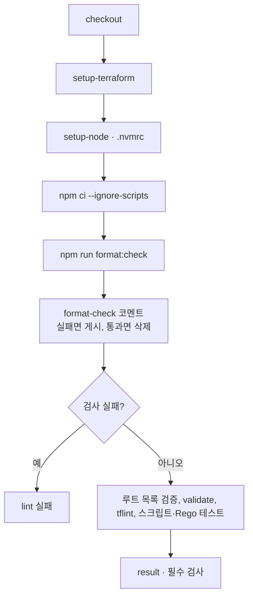

# 포맷 검사

실행 정의는 [terraform-plan.yml](https://github.com/kintoun-secops/kintoun-infra/blob/main/.github/workflows/terraform-plan.yml)의 `lint` job에 있다.
설정은 저장소 루트의 `package.json`, `.prettierrc.json`, `.prettierignore`, `.nvmrc`에서 관리한다.

Terraform은 `terraform fmt`, JavaScript와 JSON은 Prettier로 정리하며 npm 스크립트 하나가 둘을 함께 실행한다.
로컬과 CI가 같은 명령과 같은 도구 버전을 사용한다.

## 최소 요건

| 요건 | 값 | 확인 |
| --- | --- | --- |
| Node.js | `.nvmrc`의 22 이상 | `node -v` |
| npm | Node.js에 포함된 버전 | `npm -v` |
| Terraform | 루트가 요구하는 1.11 이상, PATH에 있어야 한다 | `terraform version` |
| Prettier | `package.json`에 3.9.6으로 고정, `npm ci`로 설치 | `npx prettier -v` |

AWS 자격증명과 네트워크 접근은 필요하지 않다. `npm ci --ignore-scripts`가 설치하는 의존성은 Prettier 하나다.
nvm 사용자는 저장소 루트에서 `nvm install`과 `nvm use`를 실행하면 `.nvmrc`의 버전을 사용한다.

## 명령

```bash
npm ci --ignore-scripts
npm run format
npm run format:check
```

`format`은 자동 수정, `format:check`는 파일을 바꾸지 않는 검사이며 CI가 실행하는 명령과 같다.
두 스크립트 모두 Terraform을 먼저 처리하고 Prettier를 실행한다.

| 스크립트 | 실제 명령 |
| --- | --- |
| `format` | `terraform fmt -recursive && prettier --write .` |
| `format:check` | `terraform fmt -check -recursive && prettier --check .` |

앞 명령이 실패하면 뒤 명령은 실행하지 않는다.
Terraform 포맷을 고친 뒤에는 다시 실행해 Prettier 결과까지 확인한다.

## 검사 대상

| 도구 | 대상 | 규칙 |
| --- | --- | --- |
| `terraform fmt` | 저장소 전체의 `.tf`와 `.tfvars` | Terraform 표준 형식 |
| Prettier | `.github/scripts/**/*.js`, `terraform-roots.json`, `package.json`, `package-lock.json`, `.prettierrc.json` | 들여쓰기 2칸, 작은따옴표, 100열, LF 줄바꿈, 파일 끝 개행 1개 |

`.prettierignore`는 전체를 제외한 뒤 위 경로만 다시 여는 허용 목록이다. 대상을 늘릴 때는 이 파일에 항목을 추가한다.
`terraform-roots.json`은 `.prettierrc.json`의 override로 `json-stringify` 파서를 지정해 기존의 배열 줄바꿈을 유지한다.
매니페스트의 값 자체와 루트·의존성 검증은 포맷 검사가 아니라 [`tf-roots.js`](scripts.md#루트-탐색과-wave-계산)가 맡는다.

`terraform fmt -recursive`는 `.terraform/` 같은 숨김 디렉터리를 건너뛴다.
Rego는 두 도구의 대상이 아니며 `conftest fmt .github/policy`로 정리한다.
Markdown은 [문서 CI](docs.md)의 strict 빌드가 검증한다.

## CI에서의 위치



`terraform fmt`가 동작하려면 setup-terraform이 setup-node보다 앞에 있어야 한다. 스텝 순서를 바꾸지 않는다.
`actions/setup-node`는 `node-version-file: .nvmrc`로 로컬과 같은 메이저 버전을 쓰고,
의존성이 하나뿐이므로 `package-manager-cache: false`로 캐시를 사용하지 않는다.
`npm ci`는 `package-lock.json` 그대로 설치하며 `--ignore-scripts`로 패키지의 설치 스크립트를 실행하지 않는다.

## 실패했을 때

`terraform fmt -check -recursive`는 고쳐야 할 파일 경로를 출력하고 종료 코드 3으로 끝난다.
Prettier는 `[warn]` 목록과 함께 실패한다. 두 경우 모두 `npm run format`으로 정리한 뒤 diff를 확인하고 커밋한다.

PR에서는 `lint`가 `format-check` 헤더의 sticky 코멘트 하나로 실패를 알리고 이 문서를 링크한다.
지적된 파일 목록은 코멘트에 담지 않고 `lint` 잡 로그에서 확인한다.
검사가 통과한 커밋에서는 그 코멘트를 삭제하므로 해소 여부를 PR에서 바로 확인할 수 있다.
코멘트는 알림이고, 머지를 막는 것은 `lint` 실패를 집계하는 필수 검사다.

Prettier 버전이 다르면 결과도 달라진다. 전역 설치본이 아니라 `npm ci`로 설치한 저장소의 버전을 사용한다.
버전을 올릴 때는 `package.json`의 고정 값과 `package-lock.json`을 함께 커밋하고, 같은 커밋에 재포맷 결과를 담는다.

## 머지와의 관계

`lint`가 실패하면 `result`도 실패한다. `result`는 [PR plan](plan.md#pr-검사)에서 고정하는
필수 검사 `terraform plan / result`이므로, 브랜치 보호를 적용한 상태에서는 포맷만 어긋나도 머지할 수 없다.
`lint`는 plan 대상 루트가 없는 PR에서도 항상 실행하므로 문서만 바꾼 PR도 같은 검사를 받는다.

## 편집기 연동

편집기의 Prettier 확장은 `npm ci`로 설치한 로컬 버전과 `.prettierrc.json`을 사용하도록 설정한다.
VS Code에서는 Prettier 확장(`esbenp.prettier-vscode`)을 설치하고 사용자 설정에 다음을 추가하면 저장할 때 정리된다.
저장소의 `.prettierignore`도 함께 적용된다.

```json
{
  "[javascript][json]": {
    "editor.defaultFormatter": "esbenp.prettier-vscode",
    "editor.formatOnSave": true
  }
}
```

`.tf`는 Prettier의 대상이 아니므로 HashiCorp Terraform 확장의 저장 시 포맷 기능을 사용한다.
편집기 연동 없이 `npm run format`만 사용해도 결과는 같다.

## 두 도구를 npm 스크립트로 묶은 이유

이전에는 `terraform-roots.json` 한 파일만 검사하는 자체 포맷터를 두었다.
포맷 규칙과 그 테스트를 직접 관리해야 했고 JavaScript는 검사 대상이 아니었다.
표준 도구로 옮기면서 자체 포맷터와 그 테스트는 제거했다.

Prettier에 HCL까지 맡기는 플러그인도 있으나 채택하지 않았다.
그 구현은 파일마다 `terraform fmt`를 실행하는 래퍼이므로 terraform 실행 파일은 어차피 필요하고,
기본 설정에서는 terraform 실행에 실패해도 원본을 그대로 통과시킨다.
검사 실패를 정상 판정으로 바꾸지 않는다는 이 저장소의 기준과 맞지 않는다.
`terraform fmt`를 직접 실행하면 재귀 탐색과 `.tfvars` 처리도 도구가 그대로 담당한다.
