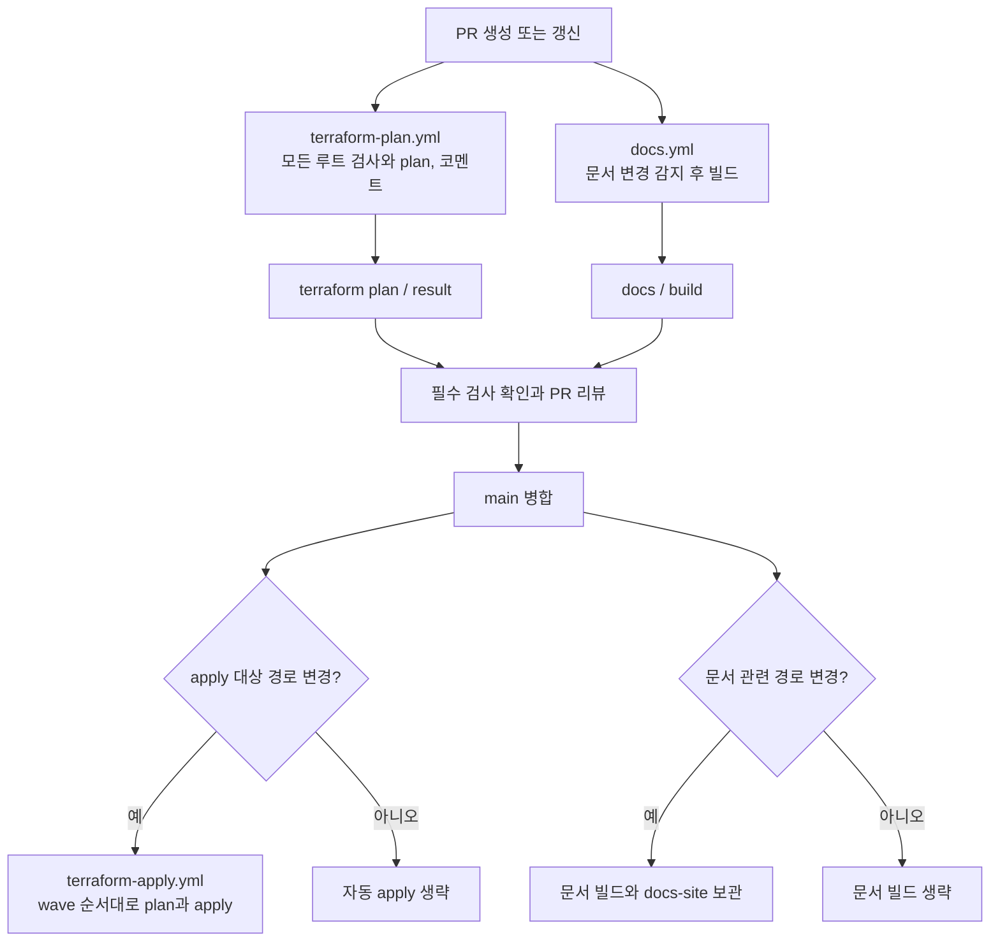

# CI 개요

CI는 `backend.tf`를 표식으로 루트를 탐색하고
`terraform-roots.json`과 대조한다. 디렉터리 목록을 워크플로에 직접 쓰지 않는다.
루트별 PR 검사는 재사용 워크플로 `_tf-root.yml`에서 실행하고,
main 적용은 `terraform-apply.yml`의 반복문에서 실행한다.
`.github/scripts/`의 파일별 역할과 실행 방법은 [CI 스크립트](scripts.md)를 참고한다.

## 문서 구성

| 문서 | 확인할 내용 |
| --- | --- |
| [PR plan과 코멘트](plan.md) | job 의존성, matrix, 결과 집계와 필수 검사 |
| [Main apply](apply.md) | wave 순서, 종료 코드별 처리와 재실행 |
| [Rego 정책](rego.md) | 자문·차단 규칙, 입력과 판정 결과, 규칙 작성·테스트 |
| [스크립트](scripts.md) | 파일별 역할, 입출력과 로컬 실행 방법 |
| [문서 CI와 Pages](docs.md) | 문서 변경 감지, strict 빌드, HTML 보관과 배포 조건 |

## 전체 흐름



필수 검사로 설정할 이름은 `terraform plan / result`와 `docs / build`다.
Terraform PR 검사는 문서만 바뀌어도 실행하고, 문서 CI는 변경 감지 결과에 따라 빌드 스텝을 생략한다.
main apply와 문서 CI는 각각 수동 실행도 지원한다.

## 구성 파일의 역할

| 위치 | 책임 |
| --- | --- |
| `.github/workflows/` | 트리거, job 의존성, 권한, 코멘트 게시와 아티팩트 전달 |
| `.github/scripts/` | 루트 탐색, AWS 정책 본문 검사, plan 요약과 apply 순서 본문 생성 |
| `.github/policy/` | Terraform plan JSON에 대한 Rego 판정 규칙과 테스트 |
| `docs/ci/` | CI 흐름과 각 구성 요소의 운영·개발 안내 |

## 루트 추가와 의존성

탐색 결과와 매니페스트 불일치, 잘못된 state key, 미등록 의존성,
순환 의존성은 CI를 실패시킨다. wave 개수는 의존 깊이에 맞춰 계산하며 고정 상한을 두지 않는다.
등록 절차와 매니페스트 형식은 [저장소 구조](../structure.md#루트-모듈-추가-절차)에 있다.

## 로컬 검증

```bash
terraform fmt -check -recursive
node .github/scripts/test-tf-roots.js
node .github/scripts/tf-roots.js
node .github/scripts/test-validate-iam-policies.js
node .github/scripts/test-plan-summary.js
conftest verify --policy .github/policy
```

backend 없이 구성 문법을 확인하려면 각 루트에서 `terraform init -backend=false`와
`terraform validate`를 실행한다. 실제 AWS plan과는 검증 범위가 다르다.
액션은 커밋 SHA로 고정하고 Dependabot이 갱신한다.

actionlint 1.7.12는 GitHub가 지원하는 `concurrency.queue`를 아직 인식하지 못한다.
해당 버전으로 로컬 검사할 때는 공식 문법을 확인한 뒤 그 진단만 제외한다.
문서 워크플로 자체는 예외 없이 검사할 수 있다.

```bash
actionlint .github/workflows/docs.yml
actionlint -ignore 'unexpected key "queue" for "concurrency" section'
```
