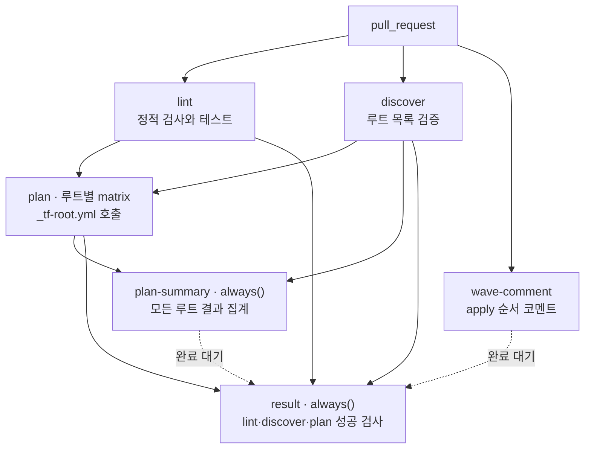
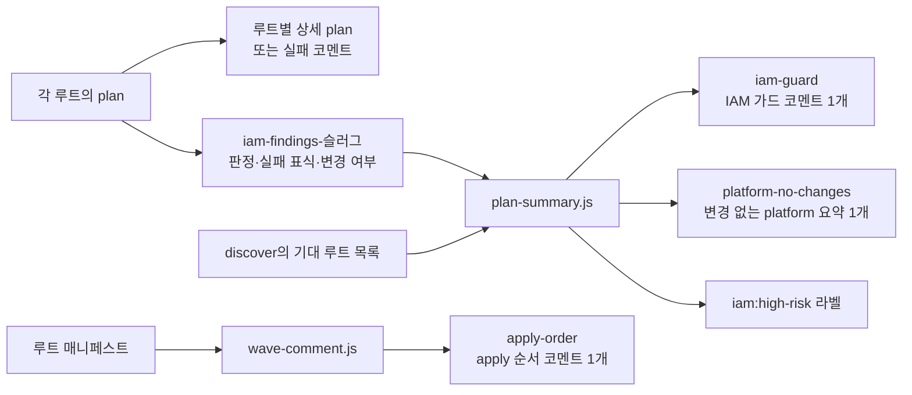

# PR plan과 코멘트

실행 정의는 [terraform-plan.yml](https://github.com/kintoun-secops/kintoun-infra/blob/main/.github/workflows/terraform-plan.yml),
루트별 검사는 [_tf-root.yml](https://github.com/kintoun-secops/kintoun-infra/blob/main/.github/workflows/_tf-root.yml)에 있다.

## Job 흐름

`lint`, `discover`, `wave-comment`는 서로 기다리지 않고 시작한다.
`plan`은 lint와 discover가 성공해야 실행하며, `fail-fast: false`로 한 루트가 실패해도
다른 루트의 plan을 계속한다. `plan-summary`와 `result`는 선행 job이 실패하거나
생략된 경우에도 `always()`로 결과를 정리한다. 점선은 성공 여부를 집계하지 않는 완료 대기다.

## PR 검사

`terraform-plan.yml`은 모든 PR에서 실행하며 경로 필터를 두지 않는다.
문서만 변경한 PR도 모든 Terraform 루트를 검사한다.

| Job | 수행 내용 |
| --- | --- |
| `lint` | fmt, 루트 탐색 테스트·검증, backend 없는 init/validate, TFLint, Rego·IAM 스크립트 테스트 |
| `discover` | 루트 목록을 검증하고 plan matrix 출력 |
| `wave-comment` | 매니페스트의 `depends_on`으로 apply 순서(wave)를 Mermaid 그래프와 표로 그려 코멘트 하나로 게시 |
| `plan` | 모든 루트를 병렬 plan, 정책 검사, 루트별 plan 코멘트 |
| `plan-summary` | 루트별 아티팩트를 수집해 IAM 가드와 변경 없는 platform plan을 각각 하나의 코멘트로 통합 |
| `result` | 항상 실행하여 lint·discover·plan 성공 여부 집계 |

`matrix`는 같은 job을 목록의 각 값으로 나눠 실행하는 기능이다.
`discover`가 찾은 루트 목록을 `matrix.dir`에 넣으므로 루트가 4개면 plan job도 4개가 된다.
각 plan은 결과 아티팩트를 올리고, matrix 밖의 `plan-summary`는 `needs: [discover, plan]`으로
모든 plan이 끝나기를 기다린 뒤 한 번만 실행하여 결과를 모아 코멘트를 작성한다.
main의 apply는 matrix를 쓰지 않고 job 하나가 의존 순서대로 루트를 반복 실행한다.

`bootstrap`은 lint의 validate 대상이지만 자동 plan/apply matrix에는 들어가지 않는다.
같은 PR의 새 커밋은 이전 plan을 취소한다. 서로 다른 PR의 state 잠금 경합은
S3 잠금과 60초의 `-lock-timeout`으로 처리한다.

!!! info "변경 없는 platform plan은 한곳에 표시합니다"
    `platform`과 하위 루트의 plan이 `No changes`이면 요약 코멘트 하나에 모아 표시합니다.
    이전 커밋의 해당 루트 상세 코멘트는 정리합니다. 다시 변경이 생기면 상세 코멘트로 표시합니다.
    import, state 관리 해제와 출력 변경은 Terraform 종료 코드가 2이므로 상세 plan을 유지합니다.
    실패하거나 검사 결과가 누락된 루트는 변경 없음으로 표시하지 않습니다.

브랜치 보호에서 고정할 필수 검사는 **`terraform plan / result`**다.
기존 `plan (platform)`, `plan (identity)` 같은 루트별 항목을 사용 중이면 교체한다.
`result`는 `lint`, `discover`, `plan`이 모두 성공해야 통과한다.
`wave-comment`와 `plan-summary`의 완료도 기다리지만, 두 코멘트 job의 실패 자체는
현재 `result`의 실패 조건에 포함하지 않는다. 따라서 코멘트 게시 실패는 해당 job 로그에서 확인한다.

## Plan 결과와 코멘트

`plan-summary`는 루트별 산출물로 **IAM 가드**와 **변경 없는 platform plan**의
두 요약 본문을 만든다. 같은 아티팩트를 한 번 수집하는 job이며,
각 본문은 용도별 sticky 코멘트 하나로 게시한다.
구현과 입출력은 [plan 요약 스크립트](scripts.md#matrix-결과를-용도별-코멘트로-모으기)에 있다.

| 코멘트 식별자 | 게시 주체 | 표시와 갱신 조건 |
| --- | --- | --- |
| `<루트> terraform plan` | 각 루트의 `plan` | 상세 plan. 변경 없는 platform 루트는 요약으로 모음 |
| `plan-failure-<슬러그>` | 각 루트의 `plan` | init·plan·JSON 추출 실패. 다음 성공 시 삭제 |
| `iam-guard` | `plan-summary` | 전체 루트의 IAM 판정. 미검사는 경고, 모두 검사하고 지적이 없으면 기존 코멘트만 해소 상태로 갱신 |
| `platform-no-changes` | `plan-summary` | 종료 코드 0인 platform 루트 목록. 해당 루트가 없으면 기존 코멘트 삭제 |
| `apply-order` | `wave-comment` | 매니페스트로 계산한 apply wave와 의존성 |

`tfplan`과 `plan.json`은 러너 내부에서만 처리하고 정리한다.
아티팩트에는 판정 메시지, 실패 표식과 변경 여부만 담고 1일 보관한다.
중첩 루트 `platform/network`의 아티팩트 이름은 `iam-findings-platform__network`다.
전체 판정 수집과 실제 차단 검사의 차이는 [Rego 정책](rego.md#판정-흐름)에 있다.

## apply 순서 코멘트

`wave-comment`는 자격증명 없이 `tf-roots.js`와 같은 계산을 다시 수행하므로 plan을 기다리지 않는다.
루트가 하나 이상 있으면 wave별 `subgraph`와 `depends_on` 화살표로 그린 Mermaid 그래프,
wave 번호와 `depends_on`을 적은 표를 `apply-order` 헤더의 sticky 코멘트로 게시한다.
GitHub가 코멘트의 Mermaid 블록을 직접 그리므로 이미지 파일을 만들거나 올리지 않는다.

매니페스트 검증에 실패하거나 루트가 없는 커밋은 새 코멘트를 만들지 않고, 이전 커밋의 코멘트가
있을 때만 계산 실패 사유로 갱신한다(`only_update`). 성공 본문에는 커밋 정보를 넣지 않으므로
매니페스트가 같으면 코멘트를 다시 쓰지 않는다(`skip_unchanged`).
로컬에서는 `node .github/scripts/wave-comment.js`로 그래프와 표를 미리 볼 수 있다.
실패 본문의 커밋 SHA와 로그 링크는 CI에서만 붙는다.
