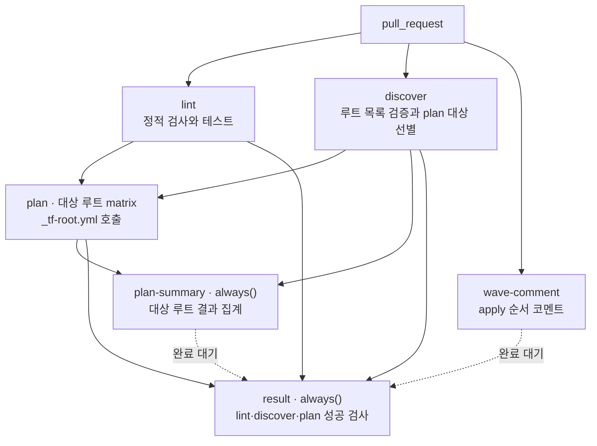
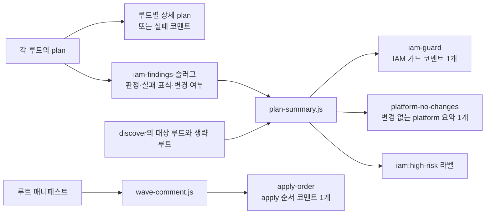

# PR plan과 코멘트

실행 정의는 [terraform-plan.yml](https://github.com/kintoun-secops/kintoun-infra/blob/main/.github/workflows/terraform-plan.yml),
루트별 검사는 [_tf-root.yml](https://github.com/kintoun-secops/kintoun-infra/blob/main/.github/workflows/_tf-root.yml)에 있다.

## Job 흐름

`lint`, `discover`, `wave-comment`는 서로 기다리지 않고 시작한다.
`plan`은 lint와 discover가 성공하고 discover가 고른 대상 루트가 있을 때만 실행하며,
`fail-fast: false`로 한 루트가 실패해도 다른 루트의 plan을 계속한다.
`plan-summary`와 `result`는 선행 job이 실패하거나
생략된 경우에도 `always()`로 결과를 정리한다. 점선은 성공 여부를 집계하지 않는 완료 대기다.

## PR 검사

`terraform-plan.yml`은 모든 PR에서 실행하며 경로 필터를 두지 않는다.
문서만 변경한 PR도 lint와 discover는 실행하지만, 변경 영향이 없는 루트의 plan은 생략한다.
선별 규칙은 [plan 대상 선별](#plan-대상-선별)에 있다.

| Job | 수행 내용 |
| --- | --- |
| `lint` | Terraform fmt와 매니페스트 JSON 포맷 검사, 루트 탐색과 plan 대상 선별 테스트, 루트 목록 검증, backend 없는 init/validate, TFLint, Rego·IAM 스크립트 테스트 |
| `discover` | 루트 목록을 검증하고 PR 변경 파일로 plan 대상과 생략 루트 출력 |
| `wave-comment` | 매니페스트의 `depends_on`으로 apply 순서(wave)를 Mermaid 그래프와 표로 그려 코멘트 하나로 게시 |
| `plan` | 대상 루트를 병렬 plan, 정책 검사, 루트별 plan 코멘트. 대상이 없으면 job 생략 |
| `plan-summary` | 대상 루트의 아티팩트를 수집해 IAM 가드와 변경 없는 platform plan을 각각 하나의 코멘트로 통합. 생략한 루트는 실패로 세지 않음 |
| `result` | 항상 실행하여 lint·discover·plan 성공 여부 집계. 대상이 없어 plan을 건너뛴 경우도 통과 |

`matrix`는 같은 job을 목록의 각 값으로 나눠 실행하는 기능이다.
`discover`가 고른 대상 루트를 `matrix.dir`에 넣으므로 대상이 4개면 plan job도 4개가 된다.
빈 matrix는 워크플로 오류이므로 대상이 없으면 `plan` job을 `if`로 건너뛴다.
각 plan은 결과 아티팩트를 올리고, matrix 밖의 `plan-summary`는 `needs: [discover, plan]`으로
모든 plan이 끝나기를 기다린 뒤 한 번만 실행하여 결과를 모아 코멘트를 작성한다.
`plan`을 건너뛴 실행에서도 `plan-summary`는 실행되어 생략 목록을 반영한다.
main의 apply는 matrix를 쓰지 않고 job 하나가 의존 순서대로 루트를 반복 실행한다.

`bootstrap`은 lint의 validate 대상이지만 자동 plan/apply matrix에는 들어가지 않는다.
같은 PR의 새 커밋은 이전 plan을 취소한다. 서로 다른 PR의 state 잠금 경합은
S3 잠금과 60초의 `-lock-timeout`으로 처리한다.

!!! info "변경 없는 platform plan은 한곳에 표시합니다"
    `platform`과 하위 루트의 plan이 `No changes`이면 요약 코멘트 하나에 모아 표시합니다.
    이전 커밋의 해당 루트 상세 코멘트는 정리합니다. 다시 변경이 생기면 상세 코멘트로 표시합니다.
    import, state 관리 해제와 출력 변경은 Terraform 종료 코드가 2이므로 상세 plan을 유지합니다.
    실패하거나 검사 결과가 누락된 루트와 plan을 생략한 루트는 변경 없음으로 표시하지 않습니다.

브랜치 보호에서 고정할 필수 검사는 **`terraform plan / result`**다.
기존 `plan (platform)`, `plan (identity)` 같은 루트별 항목을 사용 중이면 교체한다.
`result`는 `lint`, `discover`, `plan`이 모두 성공해야 통과한다.
대상 루트가 없어 `plan`을 건너뛴 경우는 discover의 대상 목록이 비어 있는지 확인하고 통과한다.
`wave-comment`와 `plan-summary`의 완료도 기다리지만, 두 코멘트 job의 실패 자체는
현재 `result`의 실패 조건에 포함하지 않는다. 따라서 코멘트 게시 실패는 해당 job 로그에서 확인한다.

## plan 대상 선별

`discover`는 PR의 변경 파일 목록을 조회하고 `tf-targets.js`로 plan 할 루트를 고른다.
이름이 바뀐 파일은 이전 경로도 변경 파일로 본다. 변경 영향이 없는 루트는 plan을 생략한다.

| 변경 파일 | plan 대상 |
| --- | --- |
| 루트 디렉터리 아래의 파일 | 그 루트와 이를 `depends_on`으로 읽는 루트. 소비 루트의 소비 루트까지 따라간다 |
| 루트가 `source`로 참조하는 로컬 모듈의 파일 | 그 모듈을 쓰는 루트와 그 소비 루트. 모듈이 부르는 모듈도 따라간다 |
| `terraform-roots.json`, `terraform-plan.yml`, `_tf-root.yml`, `.github/scripts/`, `.github/actions/`, `.github/policy/` | 전체 루트 |
| `docs/`, 최상위 `README.md`, 문서 빌드 설정, `bootstrap/`, PR·이슈 템플릿, Dependabot 설정, 문서·apply 워크플로 | 없음. 루트나 참조 모듈 안의 파일은 이 제외 규칙보다 우선한다 |
| 어떤 루트도 참조하지 않는 `modules/` 아래 파일 | 없음 |
| 그 밖에 영향 범위를 확정할 수 없는 파일 | 전체 루트 |

중첩 루트의 파일은 가장 깊은 루트의 변경으로 본다. `platform/network/main.tf`는 `platform`이 아니라
`platform/network`의 변경이다. 변경 파일이 3000개를 넘으면 목록을 확정할 수 없으므로 전체 루트를 plan 한다.
파일 목록 조회가 실패하면 `discover`가 실패하고 plan은 실행하지 않는다.
루트와 참조 모듈 안의 파일은 확장자와 무관하게 입력으로 본다. `.md`도 `file()`이나 `templatefile()`로 읽을 수 있다.
로컬 모듈 참조는 HashiCorp의 `terraform-config-inspect`로 `.tf`와 `.tf.json`에서 읽는다.
provider나 backend를 초기화하지 않고, 저장소 안의 모듈 참조를 재귀적으로 따라간다.
변수나 local을 사용하는 `source`와 해석 오류는 영향 없음이 확인된 문서 등의 변경을 제외하고
전체 plan으로 처리한다. 분석 도구 실행 실패는 discover 실패로 처리한다.
선별 결과와 사유는 `discover` job 요약의 표에서 확인한다.
로컬 실행 명령은 [plan 대상 선별 스크립트](scripts.md#plan-대상-선별)에 있다.

생략한 루트는 이번 커밋의 plan 코멘트를 만들지 않는다. 이전 커밋에서 그 루트를 plan 한 상세 코멘트가
있다면 그대로 남으므로, 루트 변경을 되돌린 커밋에서는 `discover` job 요약의 생략 목록과 함께 읽는다.
대상 루트가 하나도 없는 커밋은 IAM 가드 코멘트를 새로 만들지 않고 이전 커밋의 코멘트만
검사할 IAM 변경이 없다는 내용으로 갱신하며, `iam:high-risk` 라벨은 제거한다.

## Plan 결과와 코멘트

`plan-summary`는 루트별 산출물로 **IAM 가드**와 **변경 없는 platform plan**의
두 요약 본문을 만든다. 같은 아티팩트를 한 번 수집하는 job이며,
각 본문은 용도별 sticky 코멘트 하나로 게시한다.
구현과 입출력은 [plan 요약 스크립트](scripts.md#matrix-결과를-용도별-코멘트로-모으기)에 있다.

| 코멘트 식별자 | 게시 주체 | 표시와 갱신 조건 |
| --- | --- | --- |
| `<루트> terraform plan` | 각 루트의 `plan` | 상세 plan. 변경 없는 platform 루트는 요약으로 모음. 생략한 루트는 갱신하지 않음 |
| `plan-failure-<슬러그>` | 각 루트의 `plan` | init·plan·JSON 추출 실패. 다음 성공 시 삭제 |
| `iam-guard` | `plan-summary` | 대상 루트의 IAM 판정. 미검사는 경고, 대상이 있으면 생략한 루트를 목록으로 표시, 대상을 모두 검사하고 지적이 없으면 기존 코멘트만 해소 상태로 갱신. 대상이 없으면 plan을 생략했다는 본문으로 기존 코멘트만 갱신 |
| `platform-no-changes` | `plan-summary` | 종료 코드 0인 platform 루트 목록. 해당 루트가 없으면 기존 코멘트 삭제 |
| `apply-order` | `wave-comment` | 매니페스트로 계산한 apply wave와 의존성 |

`tfplan`과 `plan.json`은 러너 내부에서만 처리하고 정리한다.
아티팩트에는 판정 메시지, 실패 표식과 변경 여부만 담고 1일 보관한다.
중첩 루트 `platform/network`의 아티팩트 이름은 `iam-findings-platform__network`다.
전체 판정 수집과 실제 차단 검사의 차이는 [Rego 정책](rego.md#판정-흐름)에 있다.

## apply 순서 코멘트

`wave-comment`는 자격증명 없이 `tf-roots.js`와 같은 계산을 다시 수행하므로 plan을 기다리지 않는다.
루트가 하나 이상 있으면 wave별 `subgraph`와 `depends_on` 화살표로 그린 Mermaid 그래프,
wave 번호와 `depends_on`을 적은 표를 `apply-order` 헤더의 sticky 코멘트로 게시한다.
GitHub가 코멘트의 Mermaid 블록을 직접 그리므로 이미지 파일을 만들거나 올리지 않는다.

매니페스트 검증에 실패하거나 루트가 없는 커밋은 새 코멘트를 만들지 않고, 이전 커밋의 코멘트가
있을 때만 계산 실패 사유로 갱신한다(`only_update`). 성공 본문에는 커밋 정보를 넣지 않으므로
매니페스트가 같으면 코멘트를 다시 쓰지 않는다(`skip_unchanged`).
로컬에서는 `node .github/scripts/wave-comment.js`로 그래프와 표를 미리 볼 수 있다.
실패 본문의 커밋 SHA와 로그 링크는 CI에서만 붙는다.
