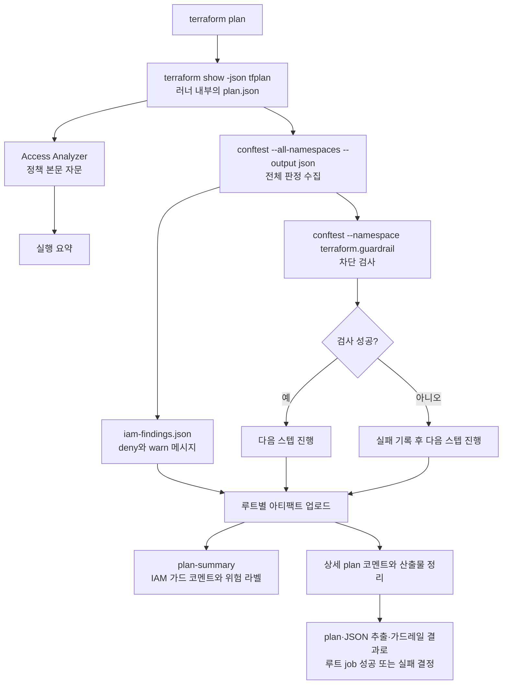

# Rego 정책

Rego는 Terraform plan JSON을 검사하는 정책 언어이며, CI에서는 conftest로 실행한다.
규칙과 단위 테스트는 [`.github/policy/`](https://github.com/kintoun-secops/kintoun-infra/tree/main/.github/policy)에 둔다.
PR의 루트별 검사 흐름은 [PR plan과 코멘트](plan.md),
결과 수집과 게시 연결은 [CI 스크립트](scripts.md)에 있다.

## 자문과 차단

| 검사 | 구현 | 실패 시 동작 |
| --- | --- | --- |
| IAM 변경 자문 | `iam.rego`의 `terraform.iam` | 위험·확인 항목을 IAM 가드 코멘트에 표시 |
| 인프라 역할 가드레일 | `guardrail.rego`의 `terraform.guardrail` | 루트의 plan job 실패. 필수 검사 `result`도 실패 |
| 정책 본문 자문 | `validate-iam-policies.js`와 AWS Access Analyzer | 실행 요약에 표시. Rego와 별도 실행 |

`deny`라는 규칙 이름만으로 병합 차단 여부가 결정되지는 않는다.
워크플로가 어느 namespace를 실행하고 종료 코드를 어떻게 처리하는지가 기준이다.
`terraform.iam`의 `deny`는 검토 신호이며, 실제 차단은 `terraform.guardrail`의 검사 결과로 결정한다.

## 판정 흐름



그림은 JSON 추출이 성공한 루트의 정책 검사와 결과 전달을 나타낸다.
정책 본문 자문, 전체 판정 수집, 차단 검사는 같은 루트에서 순서대로 실행한다.

1. `--all-namespaces --output json`으로 두 패키지의 판정을 모은다.
   이 명령의 종료 코드는 `|| true`로 흡수하고, `jq`로 출력이 JSON 배열인지 확인한다.
   판정 수집은 차단 기준을 적용하는 단계가 아니다.
2. `--namespace terraform.guardrail`로 차단 검사를 별도 실행한다.
   `continue-on-error: true`로 결과 전달 스텝을 계속 실행하고,
   마지막 `실패 처리` 스텝에서 가드레일 실패를 루트 job 실패로 반영한다.
3. `plan-summary`는 모든 루트의 아티팩트를 모아 IAM 가드 코멘트에 표시한다.
   `high`가 있으면 `iam:high-risk` 라벨을 붙이고, 모든 루트의 검사가 완료되고
   `high`가 없을 때만 라벨을 제거한다. `warn`만 남으면 라벨은 제거해도 코멘트는 유지한다.

plan이나 JSON 추출이 실패하면 Rego 검사를 생략하고 `plan-failed` 표식을 올린다.
아티팩트나 판정 파일이 누락된 루트도 미검사로 표시한다.
`tfplan`과 `plan.json`은 아티팩트로 올리지 않으며, 판정 메시지와 표식만 1일 보관한다.

## 입력과 출력

두 패키지는 `input.resource_changes`의 AWS 리소스 타입과 plan 액션을 읽는다.
변수명이나 Terraform 파일 구조를 파싱하지 않으므로 모듈을 옮겨도 같은 규칙을 적용한다.

| 입력 필드 | 용도 |
| --- | --- |
| `format_version` | `terraform.iam`에서 1.x 형식인지 확인. 누락되거나 다른 major면 위험 항목 생성 |
| `resource_changes[].type`, `address` | `aws_iam_*` 대상 선택과 판정 대상 주소 표시 |
| `change.actions` | 생성, 갱신, 삭제와 교체 판정. 교체는 `delete`와 `create`가 모두 있는 경우 |
| `change.before`, `change.after` | 권한 경계, 역할 경로, 정책 ARN과 정책 본문 비교 |
| `change.importing` | import 판정. 액션이 `no-op`이어도 검사 대상에 포함 |

일반 `no-op`과 `read`만 있는 변경은 제외한다. import는 이 필터의 예외다.
현재 형식 버전 경고는 자문 패키지에 있으므로, 지원하지 않는 형식이라는 이유만으로
가드레일 job이 자동 실패하지는 않는다. 이 경우 검사 결과를 신뢰하기 전에 규칙을 갱신한다.

각 규칙은 `finding(level, text, why)`로 `{level, msg, why}` 객체를 만든다.
conftest는 `deny`를 `failures`, `warn`을 `warnings`에 넣고,
추가 필드는 `metadata`에 담는다. `plan-summary.js`가 이를 읽어
`high`는 **위험**, `warn`은 **확인**으로 표시한다. `[차단]`은 가드레일 메시지에 붙는 표시다.

## 현재 규칙

### IAM 변경 자문

[`iam.rego`](https://github.com/kintoun-secops/kintoun-infra/blob/main/.github/policy/iam.rego)의
`terraform.iam` 패키지에서 관리한다.

| 분류 | 판정 대상 |
| --- | --- |
| 위험 (`deny`) | 사용자·IAM 개체 삭제와 교체, 권한 경계 없는 사용자 생성, 사용자 경계 제거·교체 |
| 위험 (`deny`) | 관리자·PowerUser·IAMFullAccess 계열 정책 연결, `Allow`에서 `Action: "*"`와 `Resource: "*"`를 함께 허용하는 정책 |
| 위험 (`deny`) | 누락되거나 지원하지 않는 plan JSON 형식 버전 |
| 확인 (`warn`) | 특권 정책을 제외한 서비스 FullAccess 정책 연결, 그룹 소속 변경, 사용자·그룹 생성, 교체 없는 import |

`Action`과 `Resource`의 와일드카드 검사는 `change.after.policy`의 문장을 대상으로 한다.
정책 ARN은 정규식으로 분류하며, 정책 본문의 전체 유효 권한을 계산하는 검사는 아니다.
역할 신뢰 정책을 포함한 본문 검증은 별도의 Access Analyzer 단계에서 수행한다.

### 인프라 역할 가드레일

[`guardrail.rego`](https://github.com/kintoun-secops/kintoun-infra/blob/main/.github/policy/guardrail.rego)의
`terraform.guardrail` 패키지는 `terraform.iam`의 변경 필터와 헬퍼를 재사용한다.

| 차단 조건 | 현재 범위 |
| --- | --- |
| 권한 경계가 없는 역할 생성 | `aws_iam_role`의 `create` 액션에서 `permissions_boundary`가 문자열인지 확인 |
| 프로젝트 경로 밖의 역할 생성 | 같은 대상의 `path`가 문자열이며 `/project/`로 시작하는지 확인 |

교체도 `create`를 포함하므로 검사한다. 일반 갱신, 삭제만 있는 변경과 사용자 리소스는
이 가드레일의 대상이 아니다. 경계 ARN이 특정 정책인지까지 확인하지는 않는다.
경계 정책이 apply 시점에 거부할 역할 생성 위반을 plan 단계에서 먼저 드러내는 검사다.

## 규칙 작성

1. 검토 신호는 `terraform.iam`, plan 실패로 처리할 규칙은 `terraform.guardrail`에 둔다.
2. AWS 리소스 타입과 plan 액션을 기준으로 판정한다. 교체와 import의 액션 조합도 확인한다.
3. 필수 값의 부재와 `null`을 구분해 테스트한다. Rego의 `null`은 정의된 값이므로
   `not 필드`만으로 검사하지 않는다. `iam.boundary`, `guardrail.compliant_path`처럼
   타입과 준수 조건을 명시하고, 그 조건을 충족하지 못한 경우를 위반으로 처리한다.
4. 규칙 메시지는 아티팩트와 PR 코멘트에 표시된다. 식별에 필요한 리소스 주소와
   판정 이유만 넣고 정책 본문이나 민감값을 넣지 않는다.
5. 같은 패키지의 `*_test.rego`에 정상·위반·부재·`null` 사례와 필요한 액션 조합을 추가한다.
   판정 범위나 차단 기준이 달라지면 이 문서도 갱신한다.

## 로컬 검증

저장소 루트에서 실행한다. 단위 테스트는 AWS 자격증명이나 실제 plan 파일이 필요하지 않다.
CI의 conftest 버전은 워크플로의 `CONFTEST_VERSION`에 고정한다.

```bash
conftest verify --policy .github/policy
bash .github/scripts/test-iam-pipeline.sh
node .github/scripts/test-plan-summary.js
```

`iam_test.rego`와 `guardrail_test.rego`는 작은 plan 객체를 만들어 `with input as`로 주입한다.
파이프라인 테스트는 `.github/policy/testdata/empty-plan.json`으로
전체 판정이 JSON 배열인지와 가드레일 명령 연결을 확인한다.
코멘트 테스트는 GitHub API를 모의 객체로 대체해 판정 집계와 라벨 처리를 확인한다.

공유 가능한 빈 plan 예제에 실제 검사 명령을 실행하려면 다음과 같이 한다.

```bash
conftest test .github/policy/testdata/empty-plan.json \
  --policy .github/policy --all-namespaces --output json
conftest test .github/policy/testdata/empty-plan.json \
  --policy .github/policy --namespace terraform.guardrail
```

첫 명령은 자문 패키지의 `deny`가 있어도 0이 아닌 종료 코드를 낼 수 있다.
CI는 전체 판정 수집과 가드레일의 종료 코드 처리를 분리하므로,
로컬에서도 두 명령의 목적을 구분해 확인한다.
