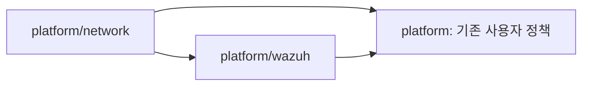

# Platform

`platform/network`는 공유 네트워크를, `platform/wazuh`는 Wazuh 호스트와 인프라 IAM을 관리한다.
사용자 IAM은 identity의 영역이지만, 기존 platform의 사용자 정책을 identity로 이전하는 작업은 별도 담당 범위다.
이번 분리에서는 사용자 정책 9개를 기존 platform state에 유지한다.

| 루트 | 관리 대상 | State key |
| --- | --- | --- |
| [Network](platform/network.md) | VPC, Internet Gateway, 서브넷, 라우팅 | `platform/network/terraform.tfstate` |
| [Wazuh](platform/wazuh.md) | EC2, 보안 그룹, EC2 역할과 인스턴스 프로파일, SSM 서비스 정책 | `platform/wazuh/terraform.tfstate` |
| 기존 `platform` | 기존 SSM 사용자 접속 정책, AWS 로그인 정책, 그룹 연결 | `platform/terraform.tfstate` |

기존 platform은 네트워크와 Wazuh의 import가 끝난 뒤 다음 wave에서 이전 대상 13개의 관리만 해제한다.
`removed` 블록은 모두 `destroy = false`다. identity의 코드와 state는 이번 분리에서 변경하지 않는다.
기존 platform의 출력 이름과 값은 새 state를 참조해 유지하므로 기존 소비자는 계속 사용할 수 있다.
새 소비자는 network와 wazuh의 출력을 직접 사용한다.

## 기존 사용자 정책

`aws_login`은 사람의 AWS CLI 로그인, `wazuh_ssm_port_forwarding`은 대시보드 포트 포워딩,
`wazuh_ssm_shell_access`는 관리자 셸 접속 권한이다.
EC2 자체가 SSM과 통신하는 `wazuh_ssm_role`은 Wazuh 루트의 인프라 IAM이다.

기존 platform의 `project_name`, `aws_login_group_names`, `port_forwarding_group_names` 입력을 유지한다.
로그인과 포트 포워딩 정책은 `WHS4_Infra`, `WHS4_Attack`, `WHS4_SIEM_Detect`에 연결한다.
셸 정책은 Terraform에서 정책 자체만 관리하고 사용자 연결은 관리하지 않는다.
코드에 attachment가 없다는 사실이 실제로 아무도 이 정책을 사용하지 않는다는 뜻은 아니다.

이전 기록과 재실행을 위해 import 및 removed 블록을 유지한다.
검증과 되돌리기는 [Platform state 이전](../runbooks/platform-migration.md)을 따른다.
대시보드 접속은 [Wazuh 접속 및 복구](../runbooks/wazuh.md)에 있다.
