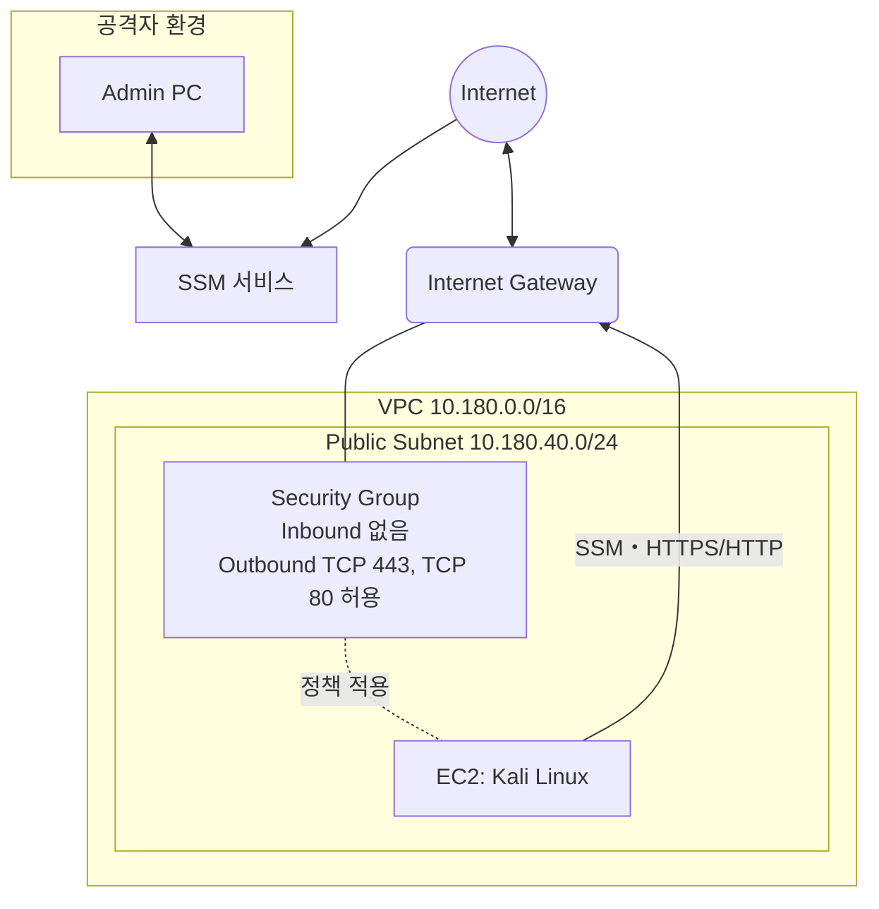

# ⚔️ Attacker EC2 구축 with Kali Linux GUI
공격 시나리오 적용 시 활용할 공격자용 EC2를 별도의 VPC에 구축하였고, 기본적인 모의 해킹 툴을 제공하는 Kali Linux GUI를 설치하였다.

Kali Linux에는 noVNC와 TigerVNC를 통해 공격자가 Kali Linux GUI를 웹으로 원격 접속할 수 있도록 구성하였다. 공격자는 포트포워딩을 통해 noVNC(6080 포트)를 연결해주면, 세션이 유지되는 동안 `http://localhost:Port`로 Kali Linux GUI 접속이 가능하다.