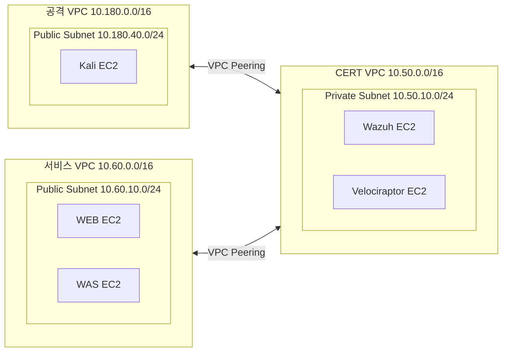
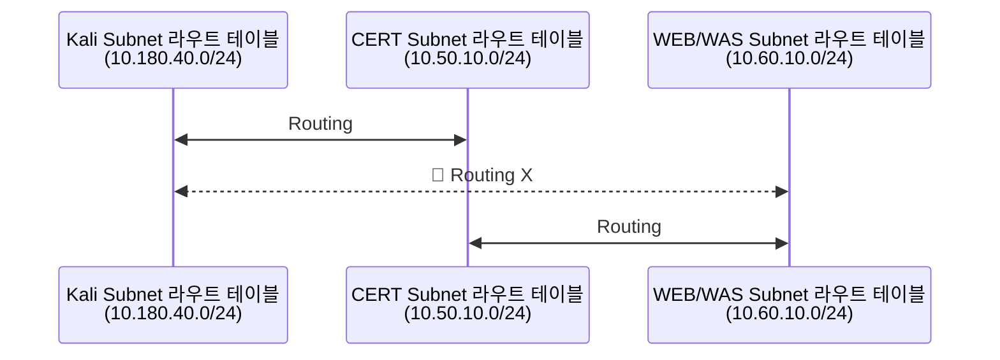
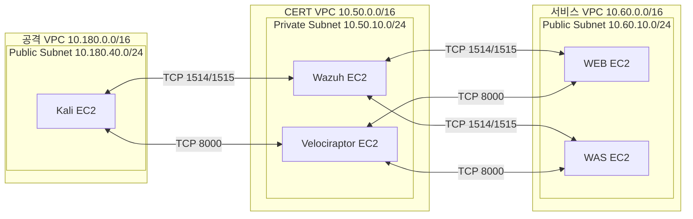

# VPC 피어링
`platform/connectivity/`는 공격 VPC <-> CERT VPC, 서비스 VPC <-> CERT VPC 간의 피어링과 라우팅, Agent 통신을 위한 보안그룹 정책을 관리한다.
 state key는 `platform/connectivity/terraform.tfsate`다.
 `platform/attacker`, `platform/network`, `platform/service-network` VPC와 서브넷, 라우트 테이블, Agent용 보안그룹 ID 출력을 읽는다.

⭐️ 각 모듈의 VPC가 선행되어 생성된 이후, `apply` 한다.

## 피어링 구조

### Route Table

### Security Group Ingress/Egress
