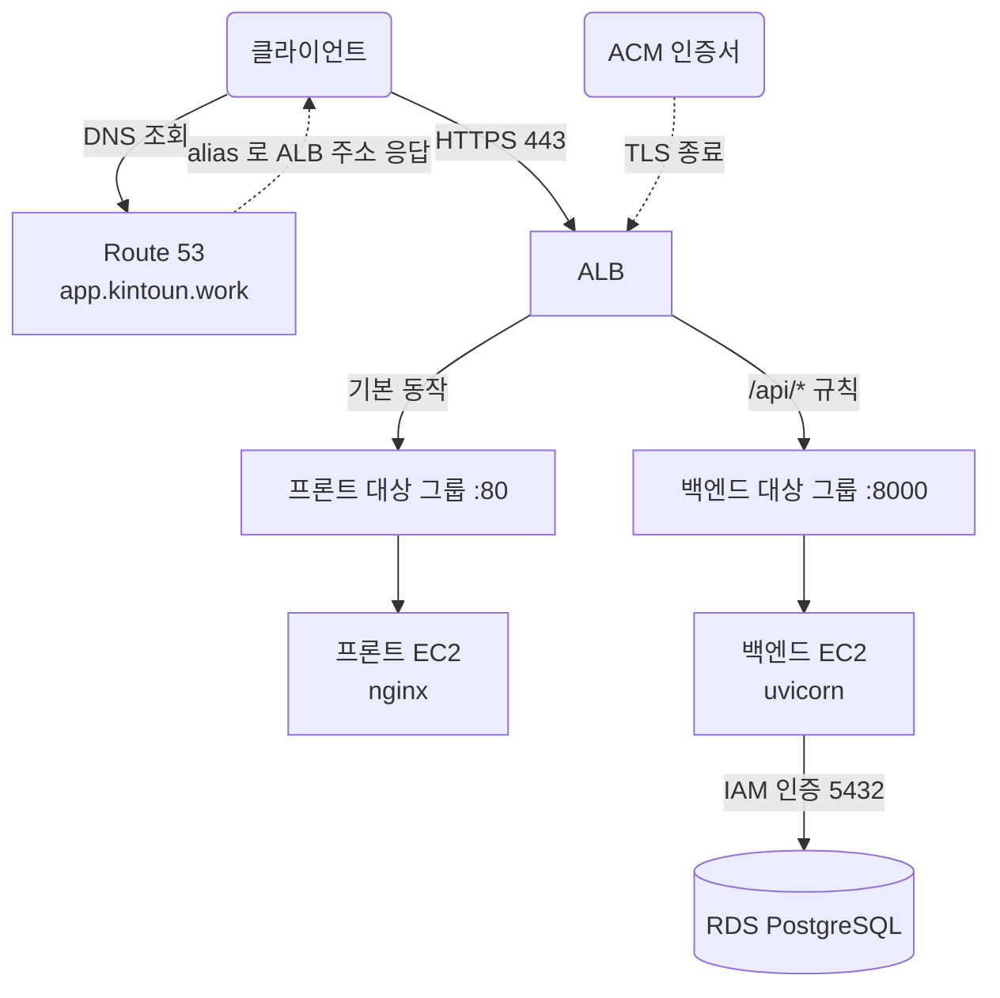
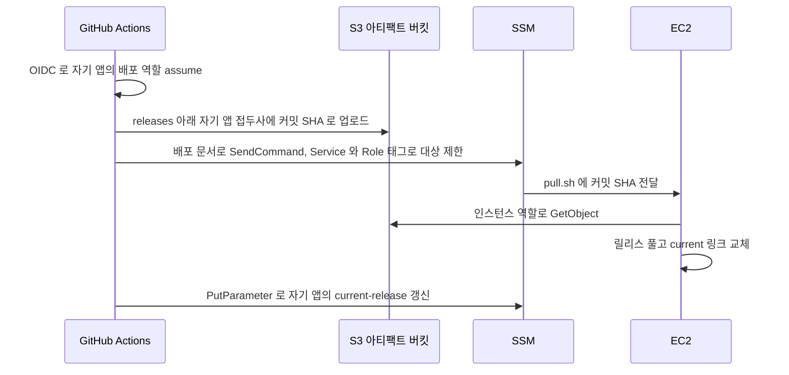

# Service App

`platform/service-app/`는 상용 서비스의 ALB, 애플리케이션 서버, 배포 경로를 관리한다.
state key는 `platform/service-app/terraform.tfstate`이며 wave2에서 적용한다.
`platform/service-network`와 `platform/service-db`의 출력을 읽는다.

| 관리하는 것 | 다른 루트에서 관리하는 것 |
| --- | --- |
| ALB, 대상 그룹 2개, 리스너와 규칙 | VPC, 서브넷, 보안 그룹 |
| ACM 인증서와 Route 53 레코드 | RDS와 데이터베이스 |
| 프론트·백엔드 EC2와 인스턴스 역할 | `kintoun.work` 호스팅 영역 |
| 앱별 배포 역할, 아티팩트 버킷, 릴리스 파라미터 | 애플리케이션 코드와 빌드 워크플로 |

## 요청 경로



ALB가 인터넷에서 받는 유일한 지점이다. TLS는 ALB가 끝낸다.
80은 443으로 리다이렉트하고, 443의 기본 동작은 프론트 대상 그룹으로 보낸다.
우선순위 100 규칙이 `/api/*`를 백엔드 대상 그룹으로 보낸다.

ALB는 경로를 고쳐 쓰지 않는다. `/api/items` 요청은 백엔드에 `/api/items`로 도착한다.
FastAPI 라우트도 `/api` 아래에 둬야 한다.

프론트 nginx는 정적 파일만 서빙한다. 백엔드로 프록시하지 않고 인증서도 다루지 않는다.
SPA 라우팅을 위해 없는 경로는 `index.html`로 넘긴다.

EC2는 퍼블릭 서브넷에 있고 공인 IP로 나간다. SSM 통신과 패키지 설치에 쓰는 아웃바운드다.
인바운드는 ALB 보안 그룹에서 오는 것뿐이라 인터넷에서 직접 닿지 않는다.

## 배포 흐름

GitHub Actions가 빌드한 결과를 S3에 올리고, SSM Run Command로 인스턴스가 받아가게 한다.



프론트엔드와 백엔드는 각자의 저장소에 있고 커밋 SHA도 따로 움직인다.
그래서 배포 역할과 릴리스 파라미터를 앱마다 나눈다.

1. 워크플로가 자기 앱의 배포 역할을 OIDC로 assume한다.
2. 빌드 결과를 `releases/frontend/<커밋 SHA>/` 또는 `releases/backend/<커밋 SHA>/`에 올린다.
3. 배포 문서로 `/opt/deploy/pull.sh <커밋 SHA>`를 실행한다.
4. 인스턴스가 인스턴스 프로파일 자격증명으로 S3에서 받아 릴리스 디렉터리에 풀고 `current` 심볼릭 링크를 옮긴다.
5. 워크플로가 `/service/frontend/current-release` 또는 `/service/backend/current-release`를 갱신한다.

키에 커밋 SHA가 들어가 배포마다 새 객체가 된다. 덮어쓰기가 없어 버킷 버저닝을 켜지 않는다.
롤백은 이전 SHA로 3번을 다시 실행한다. 릴리스는 90일 뒤 수명 주기 규칙으로 지운다.

인스턴스를 새로 띄우면 user_data가 `current-release` 파라미터를 읽어 그 릴리스를 받는다.
값이 `bootstrap`이면 서비스만 등록하고 첫 배포를 기다린다.

백엔드는 릴리스마다 독립된 venv를 만들고 `requirements.txt`를 설치한다.
GitHub 러너가 x86이고 인스턴스가 arm64라 빌드한 패키지를 그대로 옮길 수 없다.
메모리가 1GB라 user_data가 1GB 스왑 파일을 만든다. 없으면 `pip install`이 OOM으로 죽을 수 있다.

릴리스는 인스턴스 디스크에도 쌓인다. `pull.sh`가 배포할 때마다 최근 `keep_releases`개와
`current`가 가리키는 릴리스만 남기고 지운다. 루트 볼륨이 12GB라 정리하지 않으면 찬다.

## 역할과 권한

| 역할 | 주체 | 권한 |
| --- | --- | --- |
| DB 포트 포워딩 정책 | 사람 (IAM 그룹) | 백엔드 인스턴스에 `ssm:StartSession`, 자기 세션 관리 |
| 프론트 배포 역할 | 프론트 저장소 Actions (OIDC) | `releases/frontend/*` 업로드, `Role=frontend` 인스턴스에 배포 문서 실행, 프론트 파라미터 쓰기 |
| 백엔드 배포 역할 | 백엔드 저장소 Actions (OIDC) | `releases/backend/*` 업로드, `Role=backend` 인스턴스에 배포 문서 실행, 백엔드 파라미터 쓰기 |
| 프론트 인스턴스 역할 | 프론트 EC2 | `AmazonSSMManagedInstanceCore`, `releases/frontend/*` 읽기, 파라미터 읽기 |
| 백엔드 인스턴스 역할 | 백엔드 EC2 | `AmazonSSMManagedInstanceCore`, `releases/backend/*` 읽기, 파라미터 읽기, `rds-db:connect` |

배포 역할은 업로드만, 인스턴스 역할은 읽기만 가진다.
서버가 침해되어도 다음 릴리스를 바꿀 수 없고, CI가 침해되어도 기존 아티팩트를 읽을 수 없다.

`ssm:SendCommand`는 배포 문서 하나와 `Service`, `Role` 태그 조건으로 좁힌다.
`Service`가 없으면 계정 안 모든 EC2를 대상으로 삼을 수 있고,
`Role`이 없으면 프론트 저장소의 CI가 백엔드 서버를 건드릴 수 있다.

## 배포 문서

`AWS-RunShellScript`를 허용하면 역할을 가진 쪽이 서버에서 임의 명령을 실행할 수 있다.
배포 전용 문서를 만들고 역할은 이 문서만 실행하게 한다.

```
runCommand = ["/opt/deploy/pull.sh {{ sha }}"]
```

받는 파라미터는 커밋 SHA 하나이고 `allowedPattern`이 40자리 16진수만 허용한다.
파라미터에 명령을 끼워 넣을 수 없다.

업로드한 아티팩트는 서버에서 실행되므로 코드 실행 경로 자체는 남는다.
문서 제한이 막는 것은 배포와 무관한 명령이다.

## OIDC subject

조직이 immutable subject claims를 쓰면 토큰의 `sub`가 이름이 아니라 숫자 ID가 박힌 형식으로 발급된다.

```
repo:kintoun-secops@312961303/kintoun-frontend@1234567890:ref:refs/heads/main
```

`deploy_repos`의 `sub_prefix`로 이 접두사를 덮어쓴다. 생략하면 이름 기반으로 폴백한다.
값을 추측하지 말고 CloudTrail의 `AssumeRoleWithWebIdentity` 이벤트에서
`userIdentity.userName`을 확인한다. 틀리면 `Not authorized to perform sts:AssumeRoleWithWebIdentity`로 거부된다.

세 역할 모두 `/project/service/` 경로에 만들고 권한 경계를 붙인다.

OIDC 공급자는 계정과 리전당 하나뿐이라 `bootstrap`의 state를 읽지 않고 data source로 직접 조회한다.

중지한 EC2는 자동 할당 공인 IP가 회수되어 plan이 교체를 요구한다.
두 인스턴스 모두 `ignore_changes`로 막아 두었다. 기준은 [중지한 EC2와 plan 변경](../../runbooks/ec2-stopped.md)에 있다.

## 입력

| 입력 | 기본값 |
| --- | --- |
| `frontend_instance_type` | `t4g.nano` |
| `backend_instance_type` | `t4g.micro` |
| `root_volume_size` | `12` |
| `keep_releases` | `5` |
| `frontend_health_path` | `/healthz` |
| `backend_health_path` | `/api/health` |
| `artifact_retention_days` | `90` |
| `deploy_repos` | `frontend`, `backend` 두 항목. 저장소 이름은 실제 값으로 바꿔야 한다 |
| `service_domain` | `app.kintoun.work` |
| `hosted_zone_name` | `kintoun.work` |

AMI는 Amazon Linux 2023 arm64를 SSM 파라미터로 조회한다. 인스턴스가 Graviton이라 arm64 이미지를 쓴다.

## 출력

| 출력 | 용도 |
| --- | --- |
| `service_url` | 서비스 HTTPS 주소 |
| `artifact_bucket` | GitHub Actions Variable `AWS_SERVICE_ARTIFACT_BUCKET` |
| `deploy_role_arns` | 앱별 배포 역할 ARN. 각 저장소 Variable `AWS_DEPLOY_ROLE_ARN` |
| `db_port_forwarding_policy_arn` | `identity/groups.yaml` 의 `policy_arns` 에 등록 |
| `release_parameters` | 앱별 릴리스 파라미터 이름 |
| `frontend_instance_id`, `backend_instance_id` | SSM 대상 확인 |
| `alb_dns_name` | Route 53 alias 대상 |

## 적용 후 할 일

출력의 `artifact_bucket`과 `deploy_role_arns`를 각 앱 저장소의 Variables에 등록한다.
등록 전까지는 배포 워크플로가 돌지 않는다.

`db_port_forwarding_policy_arn`은 `identity/groups.yaml`의 해당 그룹 `policy_arns`에 등록한다.
등록해야 사람이 RDS로 터널을 열 수 있다.

첫 assume가 거부되면 CloudTrail에서 실제 `sub`를 확인해 `deploy_repos`의 `sub_prefix`에 넣는다.

WAF는 아직 붙이지 않았다. 실제 트래픽을 받기 전에 `aws_wafv2_web_acl`과
`aws_wafv2_web_acl_association`을 ALB에 붙인다. [Victim](../victim.md)의 구성과 같다.
