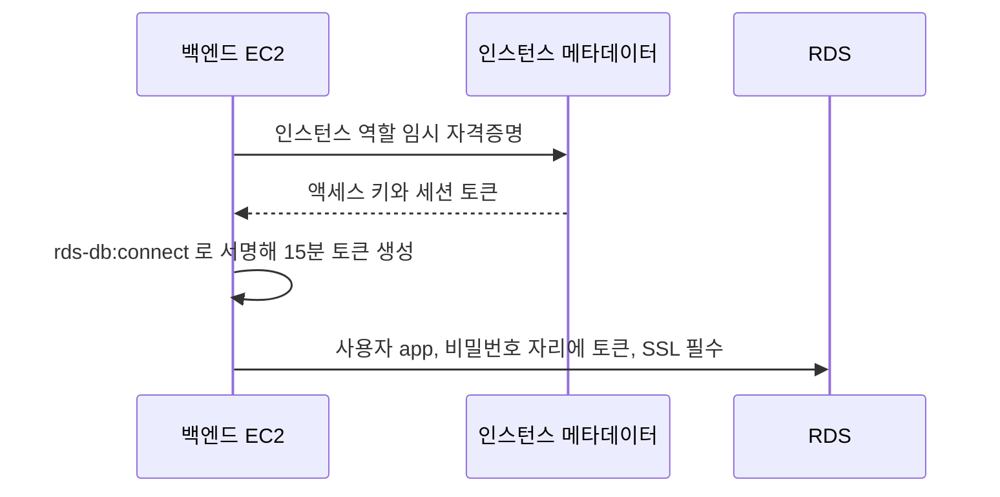

# Service DB

`platform/service-db/`는 상용 서비스가 쓰는 PostgreSQL을 관리한다.
state key는 `platform/service-db/terraform.tfstate`이며 wave1에서 적용한다.
`platform/service-network`의 VPC와 보안 그룹 출력을 읽는다.

애플리케이션 서버보다 오래 사는 자원이라 루트를 나눈다.
`platform/service-app`을 destroy해도 데이터베이스가 함께 지워지지 않는다.

| 관리하는 것 | 다른 루트에서 관리하는 것 |
| --- | --- |
| RDS 인스턴스와 파라미터 그룹 | VPC, 프라이빗 서브넷, 보안 그룹 |
| DB 서브넷 그룹 | 백엔드 EC2와 IAM 역할 |
| 인스턴스 상태 리소스 | 데이터베이스 스키마와 IAM 사용자 |

## 접속 방식

백엔드는 RDS IAM 데이터베이스 인증으로 접속한다. 비밀번호를 코드나 state에 두지 않는다.
인스턴스 역할로 15분 유효한 토큰을 만들어 비밀번호 자리에 넣는다.



`rds-db:connect` 정책은 `platform/service-app`이 만든다. 리소스 ARN에는 인스턴스 식별자가 아니라
`resource_id`를 쓰며, 이 루트가 `db_resource_id`로 출력한다.

PostgreSQL은 IAM 인증 신규 연결이 초당 20개로 제한된다. 커넥션 풀을 쓴다.
파라미터 그룹에서 `rds.force_ssl`을 1로 두어 평문 연결을 막는다.

`db.t4g.micro`는 RDS에서 가장 싼 클래스이고 스토리지 20GB도 PostgreSQL gp3의 하한이다.
더 줄일 수 있는 것은 백업 보관 기간뿐이라 기본값을 1일로 둔다.

마스터 비밀번호는 `manage_master_user_password`로 AWS가 Secrets Manager에 보관하고 교체한다.
스키마 마이그레이션과 IAM 사용자 생성에만 쓴다. 시크릿 하나당 월 0.40 USD가 든다.

## 인스턴스 상태

중지한 RDS는 7일 뒤 AWS가 다시 켠다.
`aws_rds_instance_state`가 `db_state` 변수를 따르고, 예약 워크플로가 이 루트를 주기적으로 apply해
선언한 상태로 되돌린다. 자세한 내용은 [RDS 상태 유지](../../ci/rds-state.md)에 있다.

## 입력

| 입력 | 기본값 |
| --- | --- |
| `private_subnets` | `10.50.210.0/24` (2a), `10.50.220.0/24` (2c) |
| `db_instance_class` | `db.t4g.micro` |
| `db_allocated_storage` | `20` |
| `db_max_allocated_storage` | `100` |
| `db_name` | `appdb` |
| `db_master_username` | `dbadmin` |
| `db_iam_user` | `app` |
| `db_multi_az` | `false` |
| `db_backup_retention_days` | `1` |
| `db_state` | `available` |

## 출력

| 출력 | 용도 |
| --- | --- |
| `db_endpoint`, `db_port`, `db_name`, `db_iam_user` | 백엔드 환경 변수 |
| `db_resource_id` | `rds-db:connect` 정책 ARN |
| `database_sg_id` | 보안 그룹 확인 |
| `db_identifier` | 예약 워크플로의 상태 조회 |
| `db_master_secret_arn` | 마스터 비밀번호 시크릿 |

## 적용 후 할 일

IAM 인증 사용자는 데이터베이스 안에서 만들어야 한다. Terraform은 데이터베이스 내부를 관리하지 않는다.
마스터 비밀번호로 접속해 한 번 실행한다.

```sql
CREATE USER app;
GRANT rds_iam TO app;
GRANT CONNECT ON DATABASE appdb TO app;
```

사용자명과 데이터베이스 이름은 `db_iam_user`와 `db_name`의 기본값이다. 값을 바꿨다면 그 값으로 실행한다.

RDS는 프라이빗 서브넷에 있어 외부에서 바로 닿지 않는다.
백엔드 EC2에는 terraform도 저장소도 없으므로 그 안에서 스크립트를 돌릴 수 없다.
SSM 포트 포워딩으로 백엔드를 거치는 터널만 열고 스크립트는 로컬에서 돌린다.

터널을 여는 권한은 `platform/service-app`이 만드는 `service-db-port-forwarding` 정책이다.
wazuh와 kali가 쓰는 방식과 같고, 대상 인스턴스와 문서 ARN으로만 좁혀져 있다.
그 루트의 `db_port_forwarding_policy_arn` 출력을 `identity/groups.yaml`의 `policy_arns`에 등록해야
사람이 실행할 수 있다. 등록 전에는 `ssm:StartSession`이 거부된다.

Secrets Manager 읽기와 state 접근 권한도 실행하는 사람에게 있어야 한다.

??? note "init.sh"

    `session-manager-plugin`, `psql`, `jq` 가 필요하다.

    ```bash
    #!/bin/bash
    set -Eeuo pipefail

    REPO="$(git rev-parse --show-toplevel)"
    DB_ROOT="$REPO/platform/service-db"
    APP_ROOT="$REPO/platform/service-app"
    LOCAL_PORT=15432

    DB_HOST="$(terraform -chdir="$DB_ROOT" output -raw db_endpoint)"
    DB_PORT="$(terraform -chdir="$DB_ROOT" output -raw db_port)"
    DB_NAME="$(terraform -chdir="$DB_ROOT" output -raw db_name)"
    DB_USER="$(terraform -chdir="$DB_ROOT" output -raw db_iam_user)"
    SECRET_ARN="$(terraform -chdir="$DB_ROOT" output -raw db_master_secret_arn)"
    TARGET="$(terraform -chdir="$APP_ROOT" output -raw backend_instance_id)"

    aws ssm start-session --target "$TARGET" \
        --document-name AWS-StartPortForwardingSessionToRemoteHost \
        --parameters "host=$DB_HOST,portNumber=$DB_PORT,localPortNumber=$LOCAL_PORT" &
    TUNNEL_PID=$!
    trap 'kill "$TUNNEL_PID" 2>/dev/null || true' EXIT

    for _ in $(seq 30); do
        (exec 3<>/dev/tcp/127.0.0.1/"$LOCAL_PORT") 2>/dev/null && break
        sleep 1
    done

    SECRET="$(aws secretsmanager get-secret-value \
        --secret-id "$SECRET_ARN" --query SecretString --output text)"
    PGUSER="$(jq -r .username <<<"$SECRET")"
    export PGPASSWORD="$(jq -r .password <<<"$SECRET")"

    psql -h 127.0.0.1 -p "$LOCAL_PORT" -U "$PGUSER" -d "$DB_NAME" <<SQL
    CREATE USER "$DB_USER";
    GRANT rds_iam TO "$DB_USER";
    GRANT CONNECT ON DATABASE "$DB_NAME" TO "$DB_USER";
    SQL

    unset PGPASSWORD
    ```

    터널은 백엔드 EC2 의 SSM 에이전트가 RDS 로 TCP 연결을 여는 방식이라
    백엔드 보안 그룹의 5432 아웃바운드를 그대로 쓴다. 새 경로를 열지 않는다.
