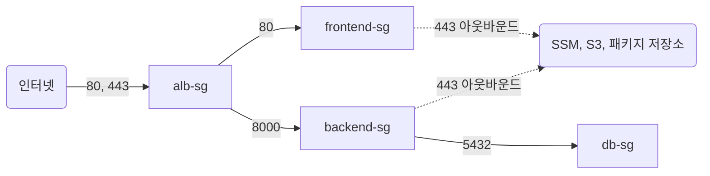

# Service Network

`platform/service-network/`는 상용 서비스 전용 VPC와 그 안의 보안 그룹을 관리한다.
state key는 `platform/service-network/terraform.tfstate`이며 매니페스트의 wave0에서 적용한다.

실습용 VPC(`platform/network`)와 분리된 VPC를 만든다. victim 호스트와 같은 네트워크에 두지 않는다.
VPC, 서브넷, 라우팅 테이블, S3 게이트웨이 엔드포인트에는 요금이 없다.

| 관리하는 것 | 다른 루트에서 관리하는 것 |
| --- | --- |
| VPC와 Internet Gateway | RDS와 서브넷 그룹 (`platform/service-db`) |
| 퍼블릭 서브넷 2개, 프라이빗 서브넷 2개, 라우팅 | ALB와 EC2 (`platform/service-app`) |
| S3 게이트웨이 엔드포인트 | 대상 그룹과 리스너 규칙 |
| ALB, 프론트, 백엔드, RDS 보안 그룹과 규칙 | |

## 보안 그룹을 한 루트에 모으는 이유

보안 그룹이 서로를 참조한다. ALB는 프론트와 백엔드를, 백엔드는 RDS를 참조한다.
이 그룹들을 각 루트에 흩어 두면 루트끼리 서로의 출력을 읽어야 해서 순환이 생긴다.
네 그룹과 규칙을 이 루트에 모아 두면 한 루트 안에서 해결되고, 소비자는 ID만 읽는다.

트래픽은 한 방향으로만 흐른다.

인터넷은 ALB에만 닿고, ALB만 프론트와 백엔드에 닿고, 백엔드만 RDS에 닿는다.
EC2는 SSM과 패키지 설치에 필요한 443 아웃바운드만 연다.

프라이빗 라우팅 테이블에 인터넷 경로를 두지 않는다. NAT Gateway를 쓰지 않는다.

## 입력

| 입력 | 기본값 |
| --- | --- |
| `vpc_cidr` | `10.60.0.0/16` |
| `public_subnets` | `10.60.10.0/24` (2a), `10.60.20.0/24` (2c) |
| `private_subnets` | `10.60.110.0/24` (2a), `10.60.120.0/24` (2c) |
| `frontend_app_port` | `80` |
| `backend_app_port` | `8000` |

ALB는 서로 다른 AZ의 퍼블릭 서브넷 두 개를 요구한다. RDS 서브넷 그룹도 Single-AZ라도 AZ 두 개를 요구한다.

## 출력

| 출력 | 용도 |
| --- | --- |
| `vpc_id`, `vpc_cidr` | VPC 식별자와 주소 범위 |
| `public_subnet_ids`, `private_subnet_ids` | AZ 키로 찾는 서브넷 ID |
| `alb_sg_id`, `frontend_sg_id`, `backend_sg_id`, `database_sg_id` | 보안 그룹 ID |
| `frontend_app_port`, `backend_app_port` | 보안 그룹 규칙과 대상 그룹이 함께 쓰는 포트 |

소비자는 이 state의 출력을 읽고 `depends_on`에 `platform/service-network`를 등록한다.
