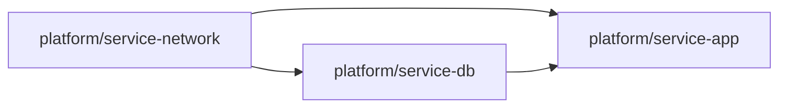
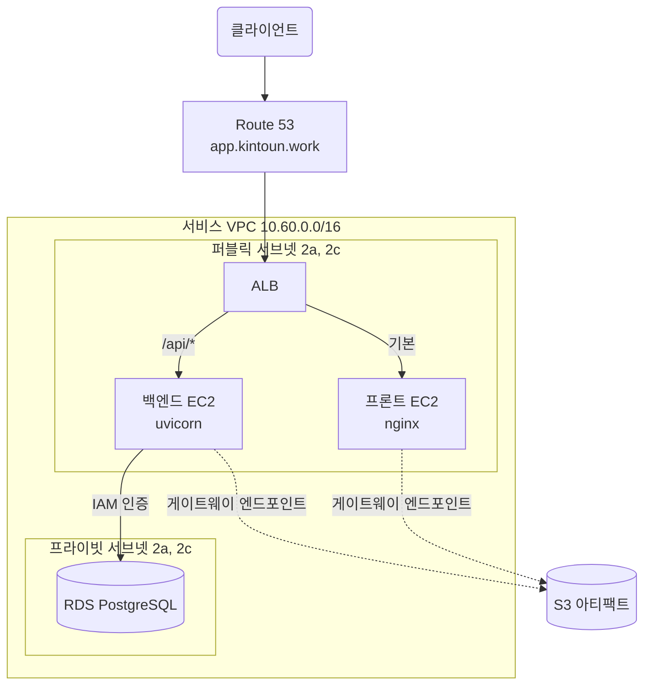

# Service

`platform/service-network`, `platform/service-db`, `platform/service-app` 세 루트가
FastAPI 백엔드와 Vite 프론트엔드, 그 둘이 쓰는 PostgreSQL을 관리한다.

실습용 `platform/network`와 분리된 전용 VPC를 쓴다. victim 호스트와 같은 네트워크에 두지 않는다.
VPC와 서브넷에는 요금이 없어 분리 비용이 들지 않는다.

| 루트 | 관리 대상 | State key |
| --- | --- | --- |
| [Service Network](platform/service-network.md) | VPC, 서브넷, 라우팅, S3 엔드포인트, 보안 그룹 4개 | `platform/service-network/terraform.tfstate` |
| [Service DB](platform/service-db.md) | RDS, 서브넷 그룹, 파라미터 그룹, 인스턴스 상태 | `platform/service-db/terraform.tfstate` |
| [Service App](platform/service-app.md) | ALB, 인증서와 DNS, EC2 2대, 배포 역할과 아티팩트 버킷 | `platform/service-app/terraform.tfstate` |
| [Service DB Init](service-db-init.md) | 데이터베이스 사용자와 권한. 사람이 apply | `platform/service-db-init/terraform.tfstate` |

## 루트를 나눈 기준

보안 그룹은 서로를 참조한다. ALB는 프론트와 백엔드를, 백엔드는 RDS를 참조한다.
흩어 두면 루트끼리 서로의 출력을 읽어야 해서 순환이 생기므로 네 개를 network 루트에 모은다.

데이터베이스는 애플리케이션 서버보다 오래 산다. 루트를 나누면 app을 destroy해도 데이터가 남는다.
RDS 상태를 주기적으로 되돌리는 워크플로도 db 루트만 apply하면 되어 `-target`이 필요 없다.

## 전체 구조

ALB가 인터넷에서 받는 유일한 지점이다. EC2는 퍼블릭 서브넷에 있지만 인바운드는 ALB에서만 받는다.
공인 IP는 SSM 통신과 패키지 설치를 위한 아웃바운드에만 쓴다. NAT Gateway를 두지 않는다.

RDS는 프라이빗 서브넷에 있고 인터넷 경로가 없다. 사람이 접속하려면 백엔드를 거치는 SSM 포트 포워딩을 쓴다.

## 배포

GitHub Actions가 빌드한 결과를 S3에 올리고 SSM Run Command로 인스턴스가 받아간다.
프론트엔드와 백엔드는 각자의 저장소에 있어 배포 역할과 릴리스 파라미터를 앱마다 나눈다.

인스턴스에 SSH 포트를 열지 않고, 정적 자격증명도 쓰지 않는다.
CI는 OIDC로, EC2는 인스턴스 역할로, 데이터베이스 접속은 IAM 인증 토큰으로 한다.

자세한 흐름은 [Service App](platform/service-app.md)에 있다.

## apply 후 사람이 해야 하는 일

apply만으로 서비스가 뜨지 않는다.

1. 배포 역할 ARN과 아티팩트 버킷 이름을 각 앱 저장소의 Variables에 등록한다.
2. 터널을 열고 [Service DB Init](service-db-init.md)을 apply해 데이터베이스 사용자를 만든다.
3. 포트 포워딩 정책과 마스터 시크릿 읽기 정책 ARN을 `identity/groups.yaml`에 등록한다.
   정책이 생성된 뒤에 해야 한다.

절차는 각 루트 문서의 마지막 절에 있다.

## 아직 없는 것

WAF를 붙이지 않았다. 실제 트래픽을 받기 전에 ALB에 연결한다. [Victim](victim.md)의 구성과 같다.
