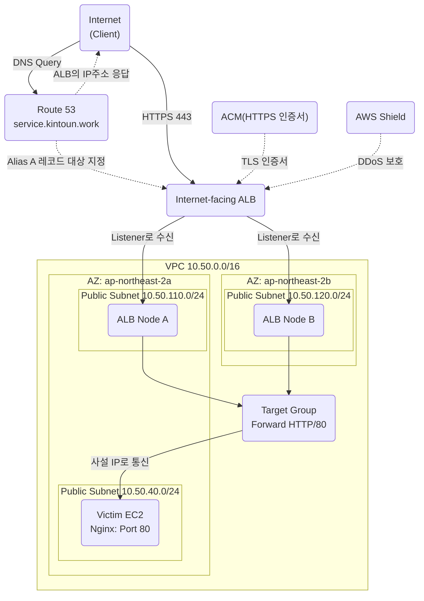

# Victim EC2 구축 및 ALB 네트워크 구성

`https://service.kintoun.work`로 접속하면 DNS 조회가 발생하며, Route 53은 Alias A 레코드가 가리키는 ALB의 현재 IP 주소를 클라이언트에 응답해준다. 클라이언트는 응답받은 주소를 이용해 ALB로 HTTPS 요청을 보내고, ALB Listener가 ACM 인증서를 사용해 TLS 연결을 처리한 후, 연결된 Target Group에서 Healthy 상태인 Victim EC2를 대상으로 선택한다.
이후 ALB가 선택된 Victim EC2의 Private IP와 애플리케이션 포트(80)로 HTTP 요청을 전달하고, Victim EC2에서 실행 중인 Nginx가 요청에 응답해준다.

```text
# 핵심 기능
- Route 53 - ALB 주소를 알려줌
- Listener 443 - HTTPS 요청을 받고 TLS 처리
- Target Group - 대상 서버, 포트, 상태 정보를 관리
- ALB - Healthy 상태인 서버를 선택하고 실제 요청을 전달
```


## 가짜 Secrets 파일을 저장하고 있는 S3 버킷 생성
공격 시뮬레이션 시 S3 버킷 내에 저장된 시크릿을 탈취하기 위한 가짜 Secrets을 저장하고 있는 S3 버킷을 생성하였다.
```text
# 버킷 구조
- bucket/
    |
    |keykey.txt
    |secrets.txt
    |account/
        |identity.txt
```
공격 실습을 위한 가짜 Secrets 파일들을 담고 있다.

## Victim EC2 구축
공격 시뮬레이션에 의해 Victim EC2 서버의 RCE를 달성하게 되면, 취약한 설정(IMDSv1)으로 Victim EC2가 profile하고 있는 IAM Role의 임시 자격증명을 획득해, S3 버킷의 객체를 얻을 수 있도록 하였다.
```text
# IAM Role 권한 정책
- s3:ListBucket - 지정한 버킷 키 목록 조회, 가짜 시크릿을 담고 있는 S3 버킷으로 리소스 제한
- s3:ListAllMyBuckets - 계정 내 모든 버킷 이름을 조회, aws s3 ls 명령이 가능하게 하였음
- s3:GetObject - 버킷 내 객체에 접근할 수 있음, 가짜 시크릿을 담고 있는 S3 버킷으로 리소스 제한
```
그리고, Victim EC2 서버에 Nginx 웹 서버를 구축해두고, ALB와 DNS를 연결하여 외부 인터넷에서 `https://service.kintoun.work`로 접속하면 Nginx의 index.html을 볼 수 있도록 하였음. (나중에 특정 웹 공격 취약점을 의도적으로 설계하고, 침투하는 방식으로 활용해도 됨)