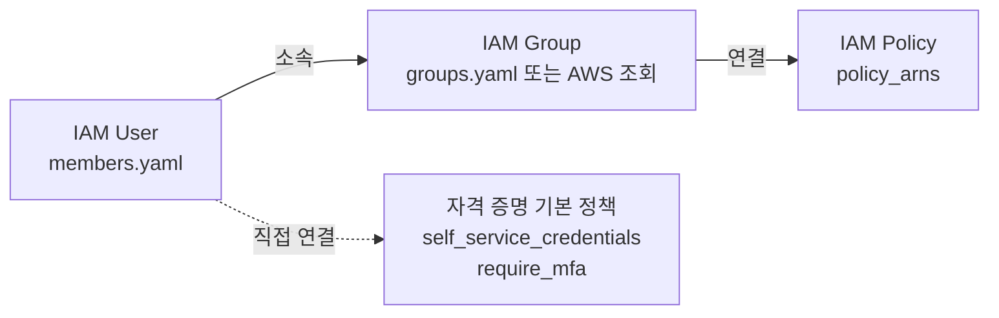

# 팀원 권한 및 그룹 변경

기존 IAM 사용자의 그룹 소속과 권한을 변경하는 절차를 설명합니다. 새 사용자를 추가하는
절차는 [새 팀원 IAM 사용자 추가](./add-user.md) 를 참조하십시오.

## 권한 부여 모델

`identity` 모듈은 다음 모델을 따릅니다.



권한은 그룹을 통해 부여합니다. 사용자에게 직접 연결하는 정책은
[`policies.tf`](https://github.com/kintoun-secops/kintoun-infra/blob/main/identity/policies.tf) 에 정의된 자격 증명 기본 정책 두 개로 한정합니다.
특정 사용자에게만 권한을 부여해야 하는 경우에도 해당 용도의 그룹을 만들어
소속시킵니다([특정 사용자에게만 권한 부여](#특정-사용자에게만-권한-부여) 참조).

## 사전 조건

- 변경 대상 사용자가 [`members.yaml`](https://github.com/kintoun-secops/kintoun-infra/blob/main/identity/members.yaml) 에 선언되어 있어야 합니다.
  선언되지 않은 사용자는 먼저 [가져오기](./add-user.md#기존-사용자-가져오기) 를
  수행하십시오.
- 변경 사항은 PR 을 통해 적용합니다. 코드가 관리하는 속성을 콘솔에서 직접 바꾸면
  다음 적용 시 코드의 값으로 돌아갈 수 있습니다.

## 그룹 소속 변경

[`members.yaml`](https://github.com/kintoun-secops/kintoun-infra/blob/main/identity/members.yaml) 에서 해당 항목의 `groups` 목록을 수정합니다.

```yaml
hong:
  groups: [TeamInfra, SIEMDetect] # SIEMDetect 추가
```

소속은 사용자 단위로 관리합니다. 목록에 추가한 그룹에는 사용자가 추가되고 코드가
관리하던 목록에서 제거한 그룹에서는 제거됩니다. 같은 그룹에 속한 다른 사용자의
소속에는 영향을 주지 않습니다. `groups`를 비우면 이 모듈이 관리하던 연결이 해제됩니다.
코드 밖에서 추가한 그룹 연결은 남을 수 있으므로 권한 회수 후 실제 소속도 확인합니다.

그룹 이름을 지정하는 규칙은 [새 팀원 IAM 사용자 추가](./add-user.md#2단계-그룹-지정)
의 2단계를 참조하십시오.

## 특정 사용자에게만 권한 부여

사용자에게 정책을 직접 연결하는 기능은 제공하지 않습니다. 해당 용도의 그룹을
[`groups.yaml`](https://github.com/kintoun-secops/kintoun-infra/blob/main/identity/groups.yaml) 에 선언하고 대상 사용자만 소속시킵니다.

```yaml
# groups.yaml
KintounS3Admin:
  policy_arns:
    - arn:aws:iam::aws:policy/AmazonS3FullAccess
```

```yaml
# members.yaml
hong:
  groups: [TeamInfra, KintounS3Admin]
```

권한을 회수할 때는 사용자의 `groups` 에서 이름을 제거하고, 그룹이 더 이상 필요하지
않으면 `groups.yaml` 에서도 함께 제거합니다.

## 그룹에 연결된 정책 변경

[`groups.yaml`](https://github.com/kintoun-secops/kintoun-infra/blob/main/identity/groups.yaml) 로 선언한 그룹의 정책은 `policy_arns` 를 수정하여
변경합니다. 목록에서 ARN 을 제거하면 해당 연결만 해제되며 다른 연결은 유지됩니다.

```yaml
KintounReadOnly:
  policy_arns:
    - arn:aws:iam::aws:policy/ReadOnlyAccess
    - arn:aws:iam::aws:policy/AWSCloudTrail_ReadOnlyAccess # 추가
```

**중요**
`groups.yaml` 에 선언한 그룹의 정책만 이 모듈이 관리합니다.

새 고객 관리형 정책이 필요한 경우 [`policies.tf`](https://github.com/kintoun-secops/kintoun-infra/blob/main/identity/policies.tf) 에
`aws_iam_policy_document` 데이터 소스와 `aws_iam_policy` 리소스를 추가한 다음, 해당
ARN 을 `groups.yaml` 의 `policy_arns` 에 지정합니다.

## MFA 적용 범위 변경

`enforce_mfa` 변수로 `require_mfa` 정책의 연결 여부를 제어합니다.

| 값 | 동작 |
| --- | --- |
| `true`(기본값) | 모든 팀원에게 `require_mfa` 정책을 연결합니다. MFA 로 인증되지 않은 세션은 MFA 등록과 비밀번호 변경 외의 모든 작업이 거부됩니다. |
| `false` | 정책 자체를 생성하지 않으며 모든 연결이 해제됩니다. |

**경고**
`enforce_mfa` 를 `true` 로 변경하면 MFA 디바이스를 등록하지 않은 사용자는 등록 절차를
완료할 때까지 다른 작업을 수행할 수 없습니다. 변경 전에 대상 사용자의 MFA 등록 상태를
확인하십시오.

## 권한 경계 변경

`permissions_boundary_arn` 변수는 이 모듈이 생성하는 모든 IAM 사용자에 적용됩니다.
값을 변경하면 전체 사용자의 유효 권한이 함께 변경되므로, 새 경계 정책이 현재 연결된 그룹
정책에서 부여한 작업을 모두 허용하는지 확인하십시오.

사용자별로 다른 경계를 적용하는 기능은 지원하지 않습니다.

## 사용자 제거

`members.yaml` 에서 해당 키를 제거하고 PR 을 생성합니다. `force_destroy_users` 변수가
`true`(기본값)이므로 로그인 프로필, 액세스 키, MFA 디바이스가 함께 삭제됩니다.

삭제 전에 다음을 확인하십시오.

- 해당 사용자가 소유한 리소스나 자동화에서 사용 중인 자격 증명이 없는지 확인합니다.
- 감사 목적으로 보존이 필요한 활동 기록은 삭제 전에 확보합니다. IAM 사용자를 삭제해도
  CloudTrail 이벤트는 유지되지만, 사용자에 연결된 구성 정보는 조회할 수 없게 됩니다.

## 사용자 이름 변경

`members.yaml` 의 키를 변경하면 Terraform 은 이를 리소스 주소 변경으로 인식하여 기존
사용자를 삭제하고 새 사용자를 생성하는 계획을 수립합니다. 비밀번호와 MFA 디바이스는
승계되지 않습니다.

이 모듈은 `name = each.key`이므로 명단 키를 바꾸면 실제 IAM 이름도 함께 바뀝니다.
`moved` 블록은 Terraform 주소를 연결할 뿐 이름 변경 자체를 없애지는 않습니다.
이름을 변경해야 한다면 사용자와 소속·정책 연결의 주소 이동 및 실제 변경을 함께 검토하고,
계획에서 로그인 정보 보존 여부와 자원 교체 여부를 확인하십시오.

## 변경 사항 검토

CI 파이프라인은 계획 결과와 별도로 **IAM 가드** 코멘트를 게시합니다. 사람 계정과
권한에 영향을 주는 변경을 표로 정리하며, 위험 항목이 있으면 PR 에 `iam:high-risk`
라벨이 붙습니다. `[차단]` 으로 표시된 항목은 plan 잡을 실패시키고, 그 외 항목은 병합을
막지 않습니다. 판단은 리뷰어가 합니다. 규칙의 구성과 실행 방법은
[Rego 정책](../ci/rego.md) 을 참조하십시오.

계획 결과에서는 다음 항목을 확인합니다.

| 확인 항목 | 정상 | 검토 필요 |
| --- | --- | --- |
| 사용자 리소스 | 변경 없음 또는 태그 갱신 | `must be replaced`, 의도하지 않은 `destroy` |
| 그룹 소속 | 대상 사용자의 `groups` 속성만 변경 | 다른 사용자 리소스가 함께 변경됨 |
| 정책 연결 | 대상 연결의 생성 또는 삭제 | `aws_iam_policy` 리소스 교체 |
| 권한 경계 | 변경 없음 | 전체 사용자의 `permissions_boundary` 변경 |

## 롤백

적용된 변경을 되돌리려면 해당 커밋을 되돌리는 PR 을 생성하여 병합합니다. 사용자 삭제를
되돌리는 경우 사용자 리소스는 다시 생성되지만 비밀번호와 MFA 디바이스는 복원되지
않으므로, [새 팀원 IAM 사용자 추가](./add-user.md) 의 4단계와 5단계를 다시 수행해야
합니다.
