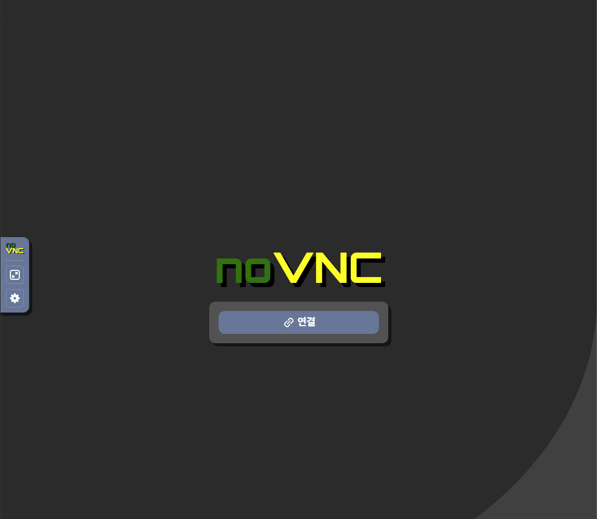
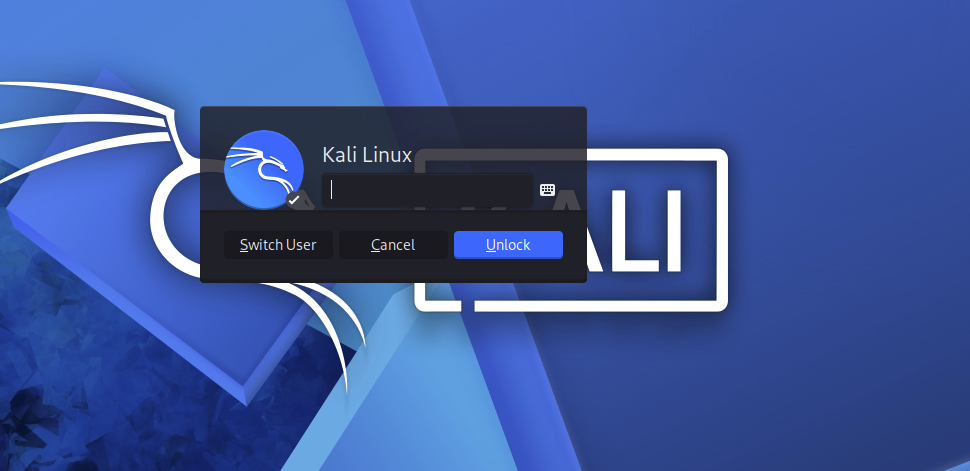
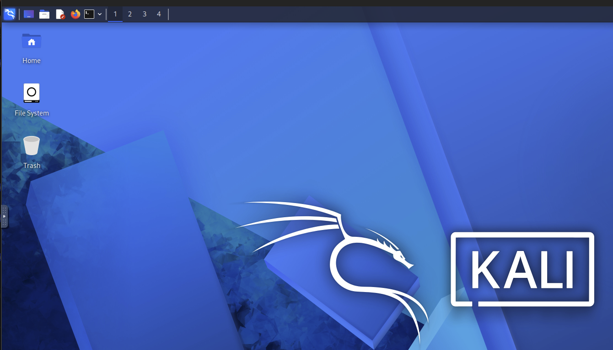

## Kali Linux GUI 접속 방법
### 권한 정책
- `kintoun-secops-infra-kali-ssm-port-forwarding` : Kali Linux GUI 웹 원격 접속을 위한 포트포워딩 권한 정책
- `kintoun-secops-infra-kali-shell-access` : Kali Linux EC2 Shell 접속을 위한 권한 정책(초기 Kali Linux GUI 웹 접속을 지원하는 서비스인 noVNC 패스워드와 Kali Linux 패스워드 설정 및 noVNC, TigerVNC 서비스 데몬 실행을 위해 사용)

⭐️ WHS4_Attack 그룹에만 Attacker EC2(Kali Linux) Shell Access 및 PortForwarding 권한 정책을 부여하는 것이 맞지만, 팀원 모두가 공격 실습을 위해 사용할 수 있도록 현재는 계정 내에 존재하는 모든 그룹에 포트포워딩 권한 정책을 붙인다.(WHS4_Attack, WHS4_Infra, WHS4_SIEM_Detect)

➡️ Shell Access 권한은 초기 설정용이기 때문에, WHS4_Attack 그룹에만 유지한다.

### noVNC 연결
`aws login` 명령으로 콘솔에서 인증하고 AWS CLI에서 사용할 임시 자격증명 발급
```shell
# 예시: aws login --profile taehyung --region ap-northeast-2
aws login --profile <본인 계정> --region ap-northeast-2
```

획득한 임시 자격증명으로 포트포워딩 터널 열기
```shell
# Linux/MacOS   # PowerShell은 줄 연결을(\ -> `(벡틱))
aws ssm start-session \
--target <kali_instance_id> \
--document-name AWS-StartPortForwardingSession \
--parameters '{"portNumber":["6080"],"localPortNumber":["6080"]}' \
--region ap-northeast-2 \
--profile <본인 계정>
```
```shell
# 터미널 출력 값
Port 6080 opened for sessionId: ...
Waiting for connections...
````
```shell
# 위 상태에서 Kali Linux GUI 웹 브라우저 접속
http://localhost:6080/vnc.html
```
### Kali Linux GUI 연결
브라우저 접속하면, noVNC 웹 브라우저 실행

연결 시, noVNC 접속 패스워드 입력


Kali Linux 접속 패스워드 입력 후, Kali Linux GUI 사용


