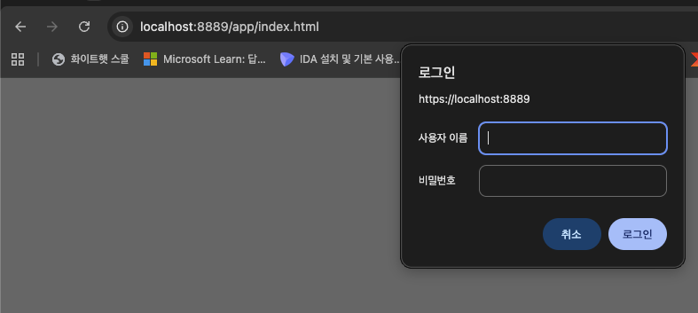
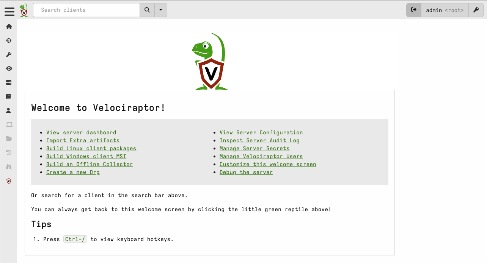

# Velociraptor GUI 접속 방법
### 권한 정책
- `kintoun-secops-infra-velociraptor-ssm-port-forwarding` : 팀원들이 Velociraptor GUI를 로컬에서 접속하기 위한 포트포워딩 권한 정책
- `kintoun-secops-infra-velociraptor-shell-access` : Velocirpator EC2 Shell 접속을 위한 권한 정책(SIEM_Detect 그룹에 부여)

⭐️ 권한 정책 연결은 identity 모듈에서 별도로 진행

## 접속 과정
### AWS Login
`aws login` 명령으로 콘솔에서 인증하고 AWS CLI에서 사용할 임시 자격증명 발급
```shell
# 예시: aws login --profile taehyung --region ap-northeast-2
aws login --profile <본인 계정> --region ap-northeast-2
```
### SSM 포트포워딩 연결
획득한 임시 자격증명으로 포트포워딩 터널 열기
```shell
# Linux/MacOS   # PowerShell은 줄 연결을(\ -> `(벡틱))
aws ssm start-session \
--target <Velociraptor_instance_id> \
--document-name AWS-StartPortForwardingSession \
--parameters '{"portNumber":["8889"],"localPortNumber":["8889"]}' \
--region ap-northeast-2 \
--profile <본인 계정>
```
```shell
# 터미널 출력 값
Starting session with SessionId: ...
Port 8889 opened for sessionId ...
Waiting for connections...
```
### Velociraptor GUI 접속
```shell
# 포트포워딩 open 상태에서 웹 브라우저 접속
https://localhost:8889
```


ID/Passwd 입력 후 사용


