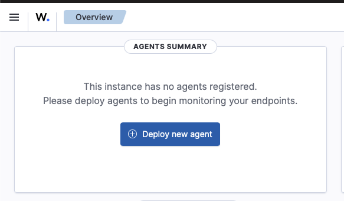
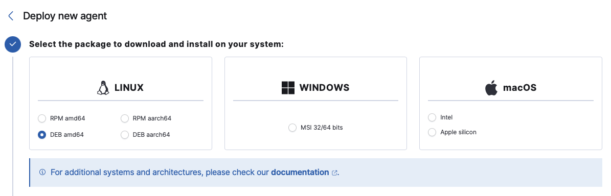
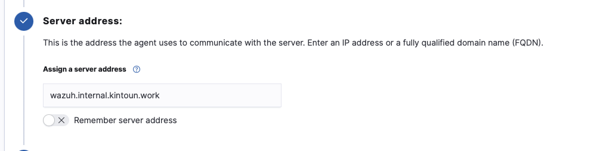
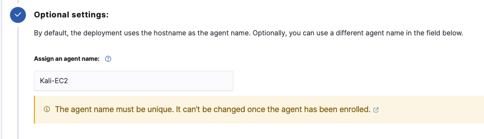
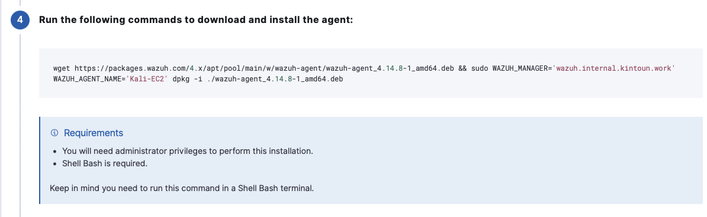

# Wazuh Agent 등록
팀 근두운 인프라에서 Wazuh Agent를 등록하는 과정을 안내하는 문서이다.

## Wazuh Agent 설치 대상
```text
- Kali Linux EC2 - 내부 PC 역할
- WEB/WAS EC2 - 운영 플랫폼 서비스
```
## Agent 설치 방법
> Wazuh 공식 문서 참고[(바로가기)](https://documentation.wazuh.com/current/installation-guide/wazuh-agent/index.html)

⭐️ 공식 문서에서 제공하는 운영체제별 Agent 설치 방법으로 Wazuh Manager의 주소를 넣어 설치해도 되지만,
</br>Wazuh Dashboard에서 OS(아키텍처 포함) 및 서버주소, Agent 이름을 입력 받아 전용 Agent 등록용 배포 파일을 만들어주기 때문에 이를 활용한다.

1. Wazuh Dashboard에서 `[+] Deploy new agent` 접속



2. Agent를 설치할 EC2의 운영체제를 선택(본 문서는 Kali EC2에 Agent를 배포하는 과정을 예시로 하였음)



3. Wazuh Manager(Server)의 IP주소 또는 FQDN 입력



💁 `wazuh.internal.kintoun.work` 도메인의 레코드가 Wazuh EC2의 Private IP를 반환하도록 Route53 레코드를 구성해뒀음

4. Wazuh Manager가 Agent를 식별하기 위한 Agent 이름 입력



💁 입력하지 않을 경우, hostname으로 생성됨
</br>⚠️ Agent 이름은 등록이후 변경할 수 없음

➡️ 이 과정까지 완료하면, 맞춤형 Agent 설치 명령어 세트를 제공함

5. Agent를 설치할 EC2의 Shell에서 명령어 세트 입력하여 설치



6. Agent 시작
```shell
# 서비스 설정 파일 최신 상태로 업데이트
sudo systemctl daemon-reload

# 부팅 시 자동 실행하도록 하고, 즉시 Start
sudo systemctl enable --now wazuh-agent
```