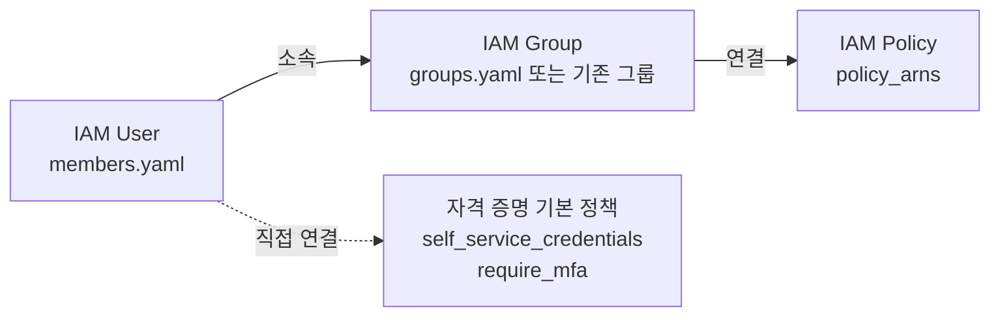

# 팀원 권한 및 그룹 변경

기존 IAM 사용자의 그룹 소속과 권한을 변경하는 절차를 설명합니다. 새 사용자를 추가하는
절차는 [새 팀원 IAM 사용자 추가](./add-user.md) 를 참조하십시오.

## 권한 부여 모델

`identity` 모듈은 다음 모델을 따릅니다.



권한은 그룹을 통해 부여합니다. 사용자에게 직접 연결하는 정책은
[`policies.tf`](../policies.tf) 에 정의된 자격 증명 기본 정책 두 개로 한정합니다.
특정 사용자에게만 권한을 부여해야 하는 경우에도 해당 용도의 그룹을 만들어 소속시키는
방식을 사용하십시오([특정 사용자에게만 권한 부여](#특정-사용자에게만-권한-부여) 참조).
사용자 단위로 정책을 연결하면 권한 현황을 그룹만으로 파악할 수 없게 됩니다.

## 사전 조건

- 변경 대상 사용자가 [`members.yaml`](../members.yaml) 에 이미 선언되어 있어야
  합니다. 선언되지 않은 사용자는 이 모듈이 관리하지 않으므로 먼저 가져오기를
  수행해야 합니다.
- 변경 사항은 PR 을 통해 적용합니다. 콘솔에서 직접 변경하면 다음 적용 시 되돌아갑니다.

## 그룹 소속 변경

[`members.yaml`](../members.yaml) 에서 해당 항목의 `groups` 목록을 수정합니다.

```yaml
hong:
  groups: [WHS4_Infra, WHS4_SIEM_Detect] # WHS4_SIEM_Detect 추가
```

[`users.tf`](../users.tf) 의 `aws_iam_user_group_membership` 리소스는 사용자 단위로
동작합니다. 목록에 추가한 그룹에는 사용자가 추가되고, 목록에서 제거한 그룹에서는
사용자가 제거됩니다. 이 리소스에 선언되지 않은 다른 사용자의 소속에는 영향을 주지
않습니다.

`groups` 를 빈 집합으로 설정하면 해당 사용자의 그룹 소속이 모두 해제됩니다. 이 경우
사용자는 자격 증명 기본 정책 외의 권한을 갖지 않습니다.

**참고**
`groups` 에 지정한 이름 중 `groups.yaml` 에 없는 이름은 기존 그룹으로 간주하여
데이터 소스로 조회합니다. 이름을 잘못 입력한 경우 계획 단계에서 오류가 발생하므로
적용 전에 확인할 수 있습니다.

## 특정 사용자에게만 권한 부여

사용자에게 정책을 직접 연결하는 기능은 제공하지 않습니다. 해당 용도의 그룹을
[`groups.yaml`](../groups.yaml) 에 선언하고 대상 사용자만 소속시킵니다.

```yaml
# groups.yaml
KintounS3Admin:
  policy_arns:
    - arn:aws:iam::aws:policy/AmazonS3FullAccess
```

```yaml
# members.yaml
hong:
  groups: [WHS4_Infra, KintounS3Admin]
```

권한을 회수할 때는 사용자의 `groups` 에서 이름을 제거하고, 그룹이 더 이상 필요하지
않으면 `groups.yaml` 에서도 함께 제거합니다.

**참고**
그룹으로 부여하더라도 권한 경계(`permissions_boundary_arn`)가 허용하지 않는 작업은
실효되지 않습니다.

## 그룹에 연결된 정책 변경

[`groups.yaml`](../groups.yaml) 로 선언한 그룹의 정책은 `policy_arns` 를 수정하여
변경합니다.

```yaml
KintounReadOnly:
  policy_arns:
    - arn:aws:iam::aws:policy/ReadOnlyAccess
    - arn:aws:iam::aws:policy/AWSCloudTrail_ReadOnlyAccess # 추가
```

[`groups.tf`](../groups.tf) 는 그룹과 정책 ARN 의 조합을 키로 사용하여
`aws_iam_group_policy_attachment` 리소스를 생성합니다. 따라서 목록에서 ARN 을 제거하면
해당 연결만 해제되며 다른 연결은 유지됩니다.

**중요**
`groups.yaml` 에 선언되지 않은 기존 그룹의 정책은 이 모듈이 관리하지 않습니다.
해당 그룹의 정책을 변경해야 하는 경우, 그 그룹의 정책 연결을 관리하는 루트 모듈에서
변경하거나 이 모듈로 가져온 후 변경하십시오. 콘솔에서 변경한 내용은 코드에 반영되지
않으므로 구성 드리프트가 발생합니다.

새 고객 관리형 정책이 필요한 경우 [`policies.tf`](../policies.tf) 에
`aws_iam_policy_document` 데이터 소스와 `aws_iam_policy` 리소스를 추가한 다음, 해당
ARN 을 `groups.yaml` 의 `policy_arns` 에 지정합니다.

## MFA 적용 범위 변경

`enforce_mfa` 변수로 `require_mfa` 정책의 연결 여부를 제어합니다.

| 값 | 동작 |
| --- | --- |
| `true`(기본값) | 모든 팀원에게 `require_mfa` 정책을 연결합니다. MFA 로 인증되지 않은 세션은 MFA 등록과 비밀번호 변경 외의 모든 작업이 거부됩니다. |
| `false` | 정책 자체를 생성하지 않으며 모든 연결이 해제됩니다. |

**경고**
`enforce_mfa` 를 `true` 로 변경하면 MFA 디바이스를 등록하지 않은 사용자는 등록 절차를
완료할 때까지 다른 작업을 수행할 수 없습니다. 변경 전에 대상 사용자의 MFA 등록 상태를
확인하십시오.

## 권한 경계 변경

`permissions_boundary_arn` 변수는 이 모듈이 생성하는 모든 IAM 사용자에 적용됩니다.
값을 변경하면 전체 사용자의 유효 권한이 함께 변경되므로, 변경 전에 새 경계 정책이
기존 그룹 정책에서 부여한 작업을 모두 허용하는지 확인하십시오. 권한 경계에서 허용하지
않는 작업은 그룹 정책으로 부여하더라도 거부됩니다.

사용자별로 다른 경계를 적용하는 기능은 현재 지원하지 않습니다.

## 사용자 제거

`members.yaml` 에서 해당 키를 제거하고 PR 을 생성합니다. `force_destroy_users` 변수가
`true`(기본값)이므로 로그인 프로필, 액세스 키, MFA 디바이스가 함께 삭제됩니다.

삭제 전에 다음을 확인하십시오.

- 해당 사용자가 소유한 리소스나 자동화에서 사용 중인 자격 증명이 없는지 확인합니다.
- 감사 목적으로 보존이 필요한 활동 기록은 삭제 전에 확보합니다. IAM 사용자를 삭제해도
  CloudTrail 이벤트는 유지되지만, 사용자에 연결된 구성 정보는 조회할 수 없게 됩니다.

## 사용자 이름 변경

`members.yaml` 의 키를 변경하면 Terraform 은 이를 리소스 주소 변경으로 인식하여 기존
사용자를 삭제하고 새 사용자를 생성하는 계획을 수립합니다. 비밀번호와 MFA 디바이스는
승계되지 않습니다.

이름을 유지한 채 주소만 변경해야 하는 경우 `moved` 블록을 사용합니다.

```hcl
moved {
  from = aws_iam_user.member["old_name"]
  to   = aws_iam_user.member["new_name"]
}
```

블록을 추가한 후 계획 결과에 삭제와 생성이 아닌 이동만 표시되는지 확인하십시오.

## 변경 사항 검토

CI 파이프라인은 계획 결과와 별도로 **IAM 가드** 코멘트를 게시합니다. 가드는
`terraform show -json` 출력의 `resource_changes` 를 읽어 사람 계정과 권한에 영향을
주는 변경(개체 삭제·재생성, 권한 경계 없는 사용자 생성, 특권 정책 연결, 그룹 소속
변경)을 표로 정리합니다. 위험 항목이 있으면 PR 에 `iam:high-risk` 라벨이 붙습니다.

가드는 병합을 차단하지 않습니다. 판단은 리뷰어가 합니다. 규칙은 Rego 로
[`.github/policy/iam.rego`](../../.github/policy/iam.rego) 에 작성하며,
[`iam_test.rego`](../../.github/policy/iam_test.rego) 의 단위 테스트가 CI 의 `lint`
잡에서 `conftest verify` 로 실행됩니다. 규칙은 AWS 리소스 타입과 계획 동작에만
의존하므로 이 모듈의 변수나 파일 구조를 바꿔도 그대로 동작합니다.

계획 결과에서는 다음 항목을 확인합니다.

| 확인 항목 | 정상 | 검토 필요 |
| --- | --- | --- |
| 사용자 리소스 | 변경 없음 또는 태그 갱신 | `must be replaced`, 의도하지 않은 `destroy` |
| 그룹 소속 | 대상 사용자의 `groups` 속성만 변경 | 다른 사용자 리소스가 함께 변경됨 |
| 정책 연결 | 대상 연결의 생성 또는 삭제 | `aws_iam_policy` 리소스 교체 |
| 권한 경계 | 변경 없음 | 전체 사용자의 `permissions_boundary` 변경 |

## 롤백

적용된 변경을 되돌리려면 해당 커밋을 되돌리는 PR 을 생성하여 병합합니다. 사용자 삭제를
되돌리는 경우 사용자 리소스는 다시 생성되지만 비밀번호와 MFA 디바이스는 복원되지
않으므로, [새 팀원 IAM 사용자 추가](./add-user.md) 의 4단계와 5단계를 다시 수행해야
합니다.
