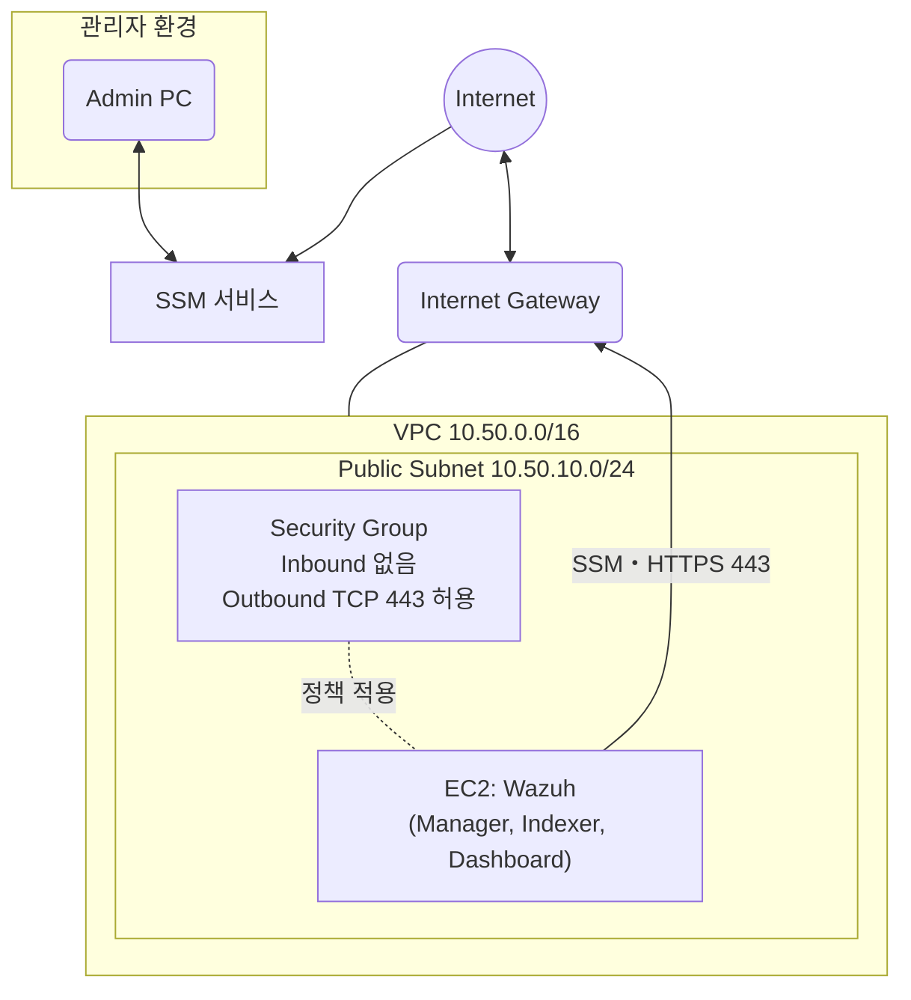

# ☁️ 근두운 인프라 기본 네트워크 구성 및 Wazuh 설치

우선 Wazuh SIEM을 설치하고, Dahsboard에 접속하여, 이벤트를 확인할 수 있도록 기본 네트워크를 먼저 구성했다.



관리자는 AWS의 SSM(Systems Manager)가 제공하는 포트포워딩을 통해 로컬 포트와 Wazuh EC2 인스턴스의 Dashboard 포트를 연결해주면, 세션이 유지되는 동안 `https://localhost:Port`로 Dashboard 접속이 가능해진다.

## SSM 포트 포워딩 방법
✅ 사전 준비
- AWS CLI 필요 [(설치방법 바로가기)](https://docs.aws.amazon.com/cli/latest/userguide/getting-started-install.html#)
- SSM Plugin 필요 [(설치방법 바로가기)](https://docs.aws.amazon.com/systems-manager/latest/userguide/session-manager-working-with-install-plugin.html)
- StartSession 권한이 있는 자격증명 - Dashboard 접속권한, Wazuh Shell 접속권한 분리하였음

aws login명령을 통해 콘솔 브라우저로 인증하여 CLI에서 사용할 임시자격증명 발급
```shell
# 예시: aws login --profile taehyung
aws login --profile <본인 계정>
```
위 명령을 입력하게 되면, region을 입력하도록 유도, `ap-northeast-2` 입력
<br/>콘솔 로그인창이 실행되고, 로그인하게 되면, 임시자격증명 획득!

임시자격증명으로 포트 포워딩 터널 열기
```shell
# Linux/MacOS   # PowerShell은 줄 연결을(\ -> `(벡틱))
aws ssm start-session \
--target <instance_id> \
--document-name AWS-StartPortForwardingSession \
--parameters '{"portNumber":["443"], "localPortNumber":["56789"]}' \
--region ap-northeast-2
--profile <본인 계정>
```
```shell
# 터미널 출력 값
Port 56789 opened for session...
Waiting for connections...
```
```
# 위 상태에서 브라우저 접속
https://localhost:56789
```

사용이 끝나면 aws logout 처리(임시자격증명이 유효기간이 12시간이라 logout해주는게 좋음)
```shell
aws logout --profile <본인계정>
```

## ssm:StartSession 권한 분리
- Wazuh 포트 포워딩 정책 : kintoun-secops-infra-wazuh-ssm-port-forwarding
- Wazuh 서버 Shell 접근 정책 : kintoun-secops-infra-wazuh-ssm-shell-access

⭐️ 역할에 맞춰서 User 또는 Group에 정책 부여 - 현재 Shell 접근 권한은 수동 정책 연결 필요<br/>
⭐️ 현재 IAM Role 사용없이 Group에 정책연결해서 사용하고 있어, 정책만 만들었음
<br/>⭐️ 누가 Shell 권한 가질지 몰라서... 포트 포워딩 정책만 WHS4_Attack, WHS4_Infra, WHS4_SIEM_Detect 그룹에 붙여놓음!(테라폼 관리)

## aws login 사용을 위한 정책
IAM User의 장기 액세스 키 사용 없이, 콘솔 브라우저 인증을 통해 CLI에서 사용할 임시자격증명을 발급(12시간 사용가능)받기 위한 정책
- kintoun-secops-infra-aws-login

WHS4_Attack, WHS4_Infra, WHS4_SIEM_Detect 그룹에 붙여놓았음(테라폼 관리)
